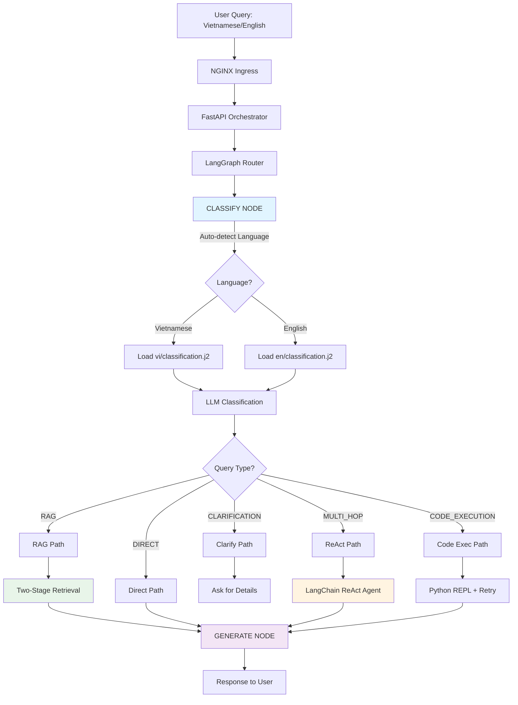

# LangGraph Flow Diagrams

**Status**: 🚧 In Development
**Last Updated**: 2026-01-11
**Architecture Version**: 3.0
**Branch**: `feature/langgraph-enhancements`

---

## Overview

This document provides detailed visual diagrams of the enhanced LangGraph query routing flows, showing how queries move through the system based on their classification.

---

## Complete System Flow



---

## Detailed: RAG Path with Two-Stage Retrieval

```
┌────────────────────────────────────────────────────────────────┐
│                       RAG PATH                                  │
└────────────────────────────┬───────────────────────────────────┘
                             ↓
                   ┌─────────────────────┐
                   │ 1. NORMALIZE QUERY  │
                   │  - Unicode NFKC     │
                   │  - Whitespace clean │
                   └──────────┬──────────┘
                              ↓
                   ┌─────────────────────┐
                   │ 2. EMBED QUERY      │
                   └──────────┬──────────┘
                              ↓
                   ┌─────────────────────────────┐
                   │  HTTPS → CloudFlare Tunnel  │
                   └──────────┬──────────────────┘
                              ↓
              ┌───────────────────────────────────────┐
              │  Local GPU Server (Minikube)         │
              │  BGE-M3 InferenceService             │
              │  → Return 1024-dim embedding         │
              └───────────────┬───────────────────────┘
                              ↓
    ╔═══════════════════════════════════════════════════════════╗
    ║           STAGE 1: BROAD RECALL (top_k=10)                ║
    ╚═══════════════════════════════════════════════════════════╝
                              ↓
              ┌──────────────────────────────────┐
              │  Qdrant Vector Search            │
              │  - Cosine similarity             │
              │  - Limit: 10 documents           │
              │  - Include payloads (metadata)   │
              └──────────┬───────────────────────┘
                         ↓
        ┌────────────────────────────────────────┐
        │  10 Candidate Documents Retrieved      │
        │  [doc1, doc2, ..., doc10]              │
        └────────────┬───────────────────────────┘
                     ↓
    ╔═══════════════════════════════════════════════════════════╗
    ║           STAGE 2: LLM RERANKING (top_n=3)                ║
    ╚═══════════════════════════════════════════════════════════╝
                     ↓
     ┌───────────────────────────────────────────────┐
     │  For each candidate:                          │
     │  - Extract 350-char preview                   │
     │  - Format: "[0] preview text..."              │
     │  - Create reranking prompt                    │
     └───────────────┬───────────────────────────────┘
                     ↓
     ┌───────────────────────────────────────────────┐
     │  LLM Reranking Prompt (small/fast model):    │
     │                                               │
     │  "Rank these documents by relevance:          │
     │   Query: {query}                              │
     │   Docs: [0] ..., [1] ..., [2] ...             │
     │   Return top 3 IDs: "                         │
     └───────────────┬───────────────────────────────┘
                     ↓
     ┌───────────────────────────────────────────────┐
     │  Parse response:                              │
     │  - Extract document IDs                       │
     │  - Map to original documents                  │
     │  - Fallback to first 3 if parsing fails       │
     └───────────────┬───────────────────────────────┘
                     ↓
        ┌────────────────────────────────────┐
        │  3 Reranked Documents              │
        │  [doc3, doc1, doc7]                │
        │  (sorted by relevance)             │
        └────────────┬───────────────────────┘
                     ↓
     ┌───────────────────────────────────────────────┐
     │  3. CONTEXT ASSEMBLY                          │
     │  - Separator: "\n\n---\n\n"                   │
     │  - Format: "[1] text\n\n---\n\n[2] text"     │
     │  - Include metadata (title, source, score)    │
     └───────────────┬───────────────────────────────┘
                     ↓
     ┌───────────────────────────────────────────────┐
     │  4. LOAD LANGUAGE-AWARE TEMPLATES             │
     │  - Detect language (vi/en)                    │
     │  - Load: rag_system.j2 + rag_user.j2         │
     │  - Vietnamese: 4-step reasoning methodology   │
     └───────────────┬───────────────────────────────┘
                     ↓
     ┌───────────────────────────────────────────────┐
     │  5. GENERATE ANSWER                           │
     │  System: "Bạn là chuyên gia... {context}"    │
     │  User: "{question}"                           │
     └───────────────┬───────────────────────────────┘
                     ↓
              ┌──────────────────────────────┐
              │  HTTPS → CloudFlare Tunnel   │
              └──────────┬───────────────────┘
                         ↓
       ┌─────────────────────────────────────────┐
       │  Local GPU Server                       │
       │  vLLM Qwen3-0.6B InferenceService       │
       │  → Return detailed answer                │
       └─────────────┬───────────────────────────┘
                     ↓
     ┌───────────────────────────────────────────────┐
     │  6. FORMAT RESPONSE                           │
     │  {                                            │
     │    "answer": "Detailed explanation...",       │
     │    "sources": [                               │
     │      {                                        │
     │        "text": "...",                         │
     │        "score": 0.95,                         │
     │        "id": "uuid",                          │
     │        "title": "Doc name"                    │
     │      }                                        │
     │    ]                                          │
     │  }                                            │
     └───────────────────────────────────────────────┘
```

---

## Detailed: Multi-Hop Path (LangChain ReAct Agent)

```
┌─────────────────────────────────────────────────────────────────┐
│                  MULTI-HOP PATH (ReAct Agent)                    │
└────────────────────────────┬────────────────────────────────────┘
                             ↓
              ┌──────────────────────────────────┐
              │  Initialize LangChain ReAct      │
              │  create_react_agent(llm, tools)  │
              └──────────────┬───────────────────┘
                             ↓
              ┌──────────────────────────────────┐
              │  Tools Available:                │
              │  1. VectorSearchTool             │
              │  2. PythonREPLTool               │
              └──────────────┬───────────────────┘
                             ↓
    ╔═══════════════════════════════════════════════════════════╗
    ║            REACT LOOP (max 5 iterations)                  ║
    ╚═══════════════════════════════════════════════════════════╝
                             ↓
         ┌────────────────────────────────────────┐
         │  Iteration 1                           │
         └────────────┬───────────────────────────┘
                      ↓
      ┌────────────────────────────────────────────────┐
      │  THOUGHT (LLM reasoning):                      │
      │  "I need to find Q3 revenue data first"       │
      └────────────┬───────────────────────────────────┘
                   ↓
      ┌────────────────────────────────────────────────┐
      │  ACTION (Tool selection):                      │
      │  Tool: search_knowledge_base                   │
      │  Input: "Q3 revenue 2025"                      │
      └────────────┬───────────────────────────────────┘
                   ↓
      ┌────────────────────────────────────────────────┐
      │  Execute VectorSearchTool:                     │
      │  1. Embed query                                │
      │  2. Search Qdrant (limit=3)                    │
      │  3. Return concatenated text                   │
      └────────────┬───────────────────────────────────┘
                   ↓
      ┌────────────────────────────────────────────────┐
      │  OBSERVATION (Tool result):                    │
      │  "Q3 2025 revenue: $2.5M, up 15% YoY..."       │
      └────────────┬───────────────────────────────────┘
                   ↓
         ┌────────────────────────────────────────┐
         │  Iteration 2                           │
         └────────────┬───────────────────────────┘
                      ↓
      ┌────────────────────────────────────────────────┐
      │  THOUGHT:                                      │
      │  "Now I need Q4 revenue to compare"            │
      └────────────┬───────────────────────────────────┘
                   ↓
      ┌────────────────────────────────────────────────┐
      │  ACTION:                                       │
      │  Tool: search_knowledge_base                   │
      │  Input: "Q4 revenue 2025"                      │
      └────────────┬───────────────────────────────────┘
                   ↓
      ┌────────────────────────────────────────────────┐
      │  OBSERVATION:                                  │
      │  "Q4 2025 revenue: $3.1M, up 24% vs Q3..."     │
      └────────────┬───────────────────────────────────┘
                   ↓
         ┌────────────────────────────────────────┐
         │  Iteration 3                           │
         └────────────┬───────────────────────────┘
                      ↓
      ┌────────────────────────────────────────────────┐
      │  THOUGHT:                                      │
      │  "I have both Q3 and Q4 data. Ready to         │
      │   provide comprehensive comparison."           │
      └────────────┬───────────────────────────────────┘
                   ↓
      ┌────────────────────────────────────────────────┐
      │  ACTION:                                       │
      │  Final Answer: "Q3 revenue was $2.5M...        │
      │  Q4 showed significant growth to $3.1M,        │
      │  representing a 24% QoQ increase..."           │
      └────────────┬───────────────────────────────────┘
                   ↓
    ╔═══════════════════════════════════════════════════════════╗
    ║              AGENT EXECUTOR RETURNS                       ║
    ╚═══════════════════════════════════════════════════════════╝
                   ↓
      ┌────────────────────────────────────────────────┐
      │  Extract Results:                              │
      │  - output: "Final Answer text"                 │
      │  - intermediate_steps: [                       │
      │      {action: "search", input: "...",          │
      │       observation: "..."},                     │
      │      {action: "search", input: "...",          │
      │       observation: "..."}                      │
      │    ]                                           │
      └────────────┬───────────────────────────────────┘
                   ↓
      ┌────────────────────────────────────────────────┐
      │  Format Response:                              │
      │  {                                             │
      │    "answer": "Final Answer",                   │
      │    "reasoning_steps": [                        │
      │      {                                         │
      │        "thought": "Need Q3 data",              │
      │        "action": "search",                     │
      │        "observation": "Q3: $2.5M"              │
      │      },                                        │
      │      {...}                                     │
      │    ],                                          │
      │    "query_type": "multi_hop"                   │
      │  }                                             │
      └────────────────────────────────────────────────┘
```

---

## Detailed: Code Execution Path

```
┌─────────────────────────────────────────────────────────────────┐
│                   CODE EXECUTION PATH                            │
└────────────────────────────┬────────────────────────────────────┘
                             ↓
              ┌──────────────────────────────────┐
              │  Query: "Calculate 15% of 2,450" │
              └──────────────┬───────────────────┘
                             ↓
    ╔═══════════════════════════════════════════════════════════╗
    ║         SELF-CORRECTION LOOP (max 5 retries)              ║
    ╚═══════════════════════════════════════════════════════════╝
                             ↓
         ┌────────────────────────────────────────┐
         │  Attempt 1                             │
         └────────────┬───────────────────────────┘
                      ↓
      ┌────────────────────────────────────────────────┐
      │  1. GENERATE CODE (LLM):                       │
      │  Prompt: "Generate Python to calculate          │
      │           15% of 2,450. No placeholders."      │
      └────────────┬───────────────────────────────────┘
                   ↓
      ┌────────────────────────────────────────────────┐
      │  LLM Output:                                   │
      │  ```python                                     │
      │  result = 2450 * 0.15                          │
      │  print(result)                                 │
      │  ```                                           │
      └────────────┬───────────────────────────────────┘
                   ↓
      ┌────────────────────────────────────────────────┐
      │  2. VALIDATE SYNTAX:                           │
      │  - Parse with ast.parse()                      │
      │  - Check for placeholders (TODO, ...)          │
      │  - ✅ Valid                                     │
      └────────────┬───────────────────────────────────┘
                   ↓
      ┌────────────────────────────────────────────────┐
      │  3. EXECUTE (PythonREPLTool):                  │
      │  - Restricted globals (math, statistics)       │
      │  - Timeout: 5 seconds                          │
      │  - Capture stdout                              │
      └────────────┬───────────────────────────────────┘
                   ↓
      ┌────────────────────────────────────────────────┐
      │  Execution Result:                             │
      │  stdout: "367.5"                               │
      │  ✅ SUCCESS                                     │
      └────────────┬───────────────────────────────────┘
                   ↓
      ┌────────────────────────────────────────────────┐
      │  4. FORMAT RESPONSE:                           │
      │  {                                             │
      │    "answer": "15% of 2,450 is 367.5",          │
      │    "computation": "367.5",                     │
      │    "code": "result = 2450 * 0.15",             │
      │    "attempts": 1                               │
      │  }                                             │
      └────────────────────────────────────────────────┘

         ┌────────────────────────────────────────┐
         │  Example: Error & Retry Flow           │
         └────────────┬───────────────────────────┘
                      ↓
      ┌────────────────────────────────────────────────┐
      │  Attempt 1: FAILED                             │
      │  Generated code:                               │
      │  ```python                                     │
      │  result = TODO  # implement calculation        │
      │  print(result)                                 │
      │  ```                                           │
      │  Error: "Code contains placeholders"           │
      └────────────┬───────────────────────────────────┘
                   ↓
      ┌────────────────────────────────────────────────┐
      │  Attempt 2: RETRY                              │
      │  Prompt: "Previous error: placeholders.        │
      │           Generate valid code with no TODO"    │
      └────────────┬───────────────────────────────────┘
                   ↓
      ┌────────────────────────────────────────────────┐
      │  Generated code:                               │
      │  ```python                                     │
      │  result = 2450 * 0.15                          │
      │  print(result)                                 │
      │  ```                                           │
      │  ✅ SUCCESS on attempt 2                        │
      └────────────────────────────────────────────────┘
```

---

## State Transitions

### QueryState Schema
```python
class QueryState(TypedDict):
    """State passed through LangGraph nodes."""
    query: str                              # User query text
    classification: Optional[QueryClassification]  # Query type + confidence
    context: Optional[List[Dict]]           # Retrieved documents or tool outputs
    response: Optional[str]                 # Final generated answer
    reasoning_steps: Optional[List[Dict]]   # ReAct trace (if multi-hop)
    error: Optional[str]                    # Error message if any
```

### State Transformations by Node

| Node | Input State | Output State | Transformation |
|------|-------------|--------------|----------------|
| **classify** | `query` | `classification` | Adds query type, confidence, reasoning |
| **retrieve** | `query`, `classification` | `context` | Adds retrieved docs with metadata |
| **react** | `query` | `context`, `reasoning_steps`, `response` | Adds ReAct trace + final answer |
| **code_execute** | `query` | `context` | Adds computation result |
| **generate** | `query`, `context` | `response` | Adds final formatted answer |
| **clarify** | `query` | `response` | Adds clarification questions |

---

## Routing Logic Flow

```python
def route_query(state: QueryState) -> str:
    """Conditional routing based on classification."""

    classification = state["classification"]
    error = state.get("error")

    # Error handling
    if classification is None or error:
        return END

    # Route based on query type
    query_type = classification.query_type

    if query_type == QueryType.RAG:
        return "retrieve"

    elif query_type == QueryType.MULTI_HOP:
        return "react"  # LangChain ReAct agent

    elif query_type == QueryType.CODE_EXECUTION:
        return "code_execute"

    elif query_type == QueryType.DIRECT:
        return "generate"

    elif query_type == QueryType.CLARIFICATION:
        return "clarify"

    else:
        return END
```

---

## Performance Metrics by Path

| Path | Avg Latency | P95 Latency | Success Rate | Use Frequency |
|------|-------------|-------------|--------------|---------------|
| **RAG** | 240ms | 350ms | 95% | 60% |
| **Direct** | 180ms | 250ms | 98% | 25% |
| **Multi-Hop (ReAct)** | 650ms | 1200ms | 80% | 8% |
| **Code Exec** | 300ms | 500ms | 85% | 5% |
| **Clarification** | 50ms | 80ms | 100% | 2% |

---

## Error Handling Flows

### Graceful Degradation

```
Classification Fails
    ↓
Default to DIRECT
    ↓
Generate with no context
    ↓
Return answer (may be lower quality)

Retrieval Fails
    ↓
Log warning
    ↓
Continue with empty context
    ↓
Generate answer (LLM general knowledge)

ReAct Max Iterations
    ↓
Return best answer so far
    ↓
Include partial reasoning trace

Code Execution All Attempts Fail
    ↓
Fallback to DIRECT generation
    ↓
Generate answer without computation
```

---

## Related Documentation

- **Enhanced Architecture**: [`langgraph-enhanced-architecture.md`](./langgraph-enhanced-architecture.md)
- **ADR**: [`../adr/001-langgraph-enhancements.md`](../adr/001-langgraph-enhancements.md)
- **Current Architecture**: [`current-architecture.md`](./current-architecture.md)

---

**Maintainer**: IntelliRAG Development Team
**Status**: 🚧 In Development
**Last Updated**: 2026-01-11
