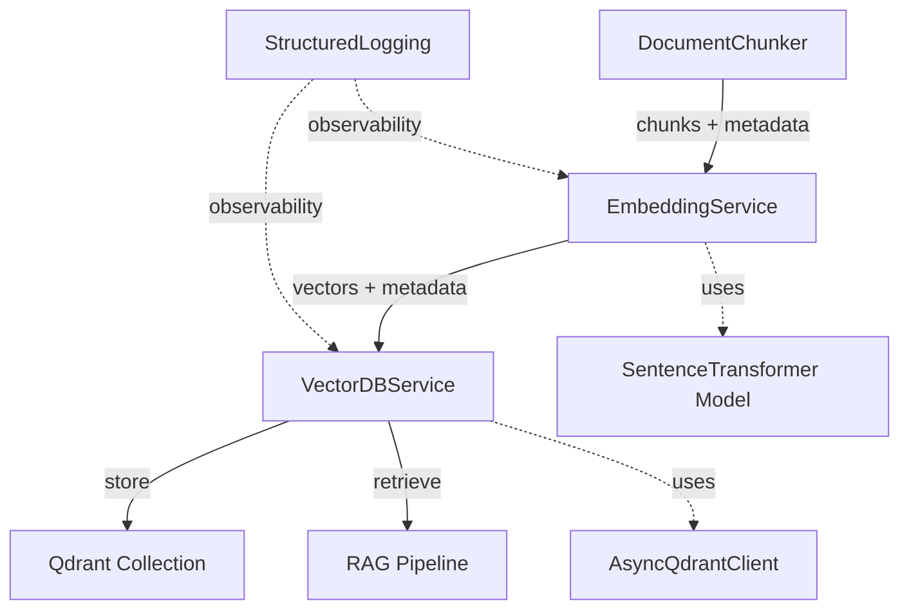

# Vector Database & Embedding Service Implementation Plan

**Date:** 2025-10-14 (Updated: 2025-10-15)
**Project:** IntelliRAG - Production-Ready RAG System
**Feature:** Vector Database Setup with Embedding Service
**Methodology:** Test-Driven Development (TDD)
**Coverage Target:** >80%
**Priority:** HIGH (Critical Path for RAG System)

**Version:** 2.0 - Updated with multilingual model, GPU/CPU hybrid strategy, and multimodal architecture

---

## 1. RECOMMENDATION: Implement Vector Database Setup First (Option A)

### Executive Summary
**STRONG RECOMMENDATION: Implement Vector Database Setup (Option A) before API Endpoints (Option B)**

### Justification

#### Data Flow Analysis
```
Current State:  Document Upload → Preprocessing ✅ → [GAP] → RAG Query
Target State:   Document Upload → Preprocessing ✅ → Embedding → Storage → Retrieval → RAG Query
```

The preprocessing pipeline is 70% complete with robust document handlers, chunking strategies, security validations, and structured logging. The next logical step in the data pipeline is:

1. **Embedding Service**: Convert preprocessed text chunks into 384-dimensional vectors
2. **Vector Database Service**: Store and retrieve embeddings efficiently
3. **API Endpoints**: Orchestrate the complete pipeline

#### Technical Dependencies
- **API depends on Backend Services**: API endpoints need functional embedding and vector DB services to be meaningful
- **Testability**: Embedding and vector DB services can be independently tested with mocked data
- **Incremental Development**: Build data layer first, then presentation layer
- **Integration**: Preprocessing outputs (chunks with metadata) are ready to be consumed by embedding service

#### Risk Mitigation
- **Parallel Implementation Risk**: Building API and backend together increases integration complexity
- **Testing Pyramid**: Unit tests for services first, then integration tests, finally API tests
- **Clear Contracts**: Well-defined service interfaces enable API development once backend is stable

#### Business Value
- **Unblocks RAG Pipeline**: Enables end-to-end document ingestion and retrieval
- **Foundation for Future Features**: Query routing, semantic search, and advanced retrieval depend on vector storage
- **Demonstrates Core Functionality**: Stakeholders can test document similarity search

### Alternative Considered
**Option B (API Endpoints First)**: Would create endpoints with no backend functionality, requiring extensive mocking and rework once services are built. Not aligned with incremental delivery principles.

---

## 2. ARCHITECTURE OVERVIEW

### High-Level Component Design



### Service Responsibilities

#### EmbeddingService (`app/services/embedding.py`)
**Purpose**: Transform text chunks into dense vector embeddings with multilingual support

**Responsibilities**:
- Load and manage SentenceTransformer model (`paraphrase-multilingual-mpnet-base-v2`)
- Batch encode text chunks for efficiency (GPU/CPU hybrid)
- Normalize embeddings for cosine similarity
- Cache model in memory (singleton pattern)
- Provide async interface for non-blocking operations
- Log embedding metrics (batch size, duration, vector dimensions, device)
- Support OCR-based image embedding (Phase 1)
- Abstract interface for future multimodal embeddings (Phase 2)

**Key Capabilities**:
- Single text encoding (CPU-optimized for real-time queries)
- Batch text encoding (GPU-accelerated when available, configurable batch size)
- Model lazy loading (load on first use)
- Embedding dimension validation (768-d)
- Device management (automatic GPU/CPU switching)
- Multilingual support (50+ languages)
- Image embedding via OCR (Phase 1)

#### VectorDBService (`app/services/vectordb.py`)
**Purpose**: Manage vector storage and retrieval in Qdrant with rich metadata support

**Responsibilities**:
- Initialize and manage AsyncQdrantClient (hybrid: local Docker + Qdrant Cloud)
- Create and manage collections with proper configurations (768-d vectors)
- Upsert vectors with rich metadata payload
- Search for similar vectors with complex filtering (AND/OR/NOT logic)
- Handle connection failures gracefully
- Implement retry logic with exponential backoff
- Log vector DB operations (insertion count, query time, collection stats)
- Support custom query parser integration (future)

**Key Capabilities**:
- Collection lifecycle management (create, exists, delete)
- Batch vector insertion with rich metadata (timestamp, document_type, topic, category, user_id, document_id, chunk_id, language, document_data)
- Similarity search with score threshold
- Complex metadata filtering (Qdrant built-in filters with AND/OR/NOT)
- Collection info retrieval (vector count, config)
- Date range filtering and list filters support

### Data Flow

#### Ingestion Pipeline
```python
# 1. Document processed by handlers
chunks = handler.process(file_path)  # List[Dict[str, Any]]

# 2. Extract text from chunks
texts = [chunk['text'] for chunk in chunks]

# 3. Generate embeddings
embeddings = await embedding_service.embed_batch(texts)

# 4. Prepare points with rich metadata
import datetime
points = [
    {
        'id': str(uuid.uuid4()),
        'vector': embedding,
        'payload': {
            'text': chunk['text'],
            'timestamp': datetime.datetime.utcnow().isoformat(),
            'document_type': 'pdf',  # or 'docx', 'csv', 'txt', 'image'
            'topic': 'finance',
            'category': 'reports',
            'user_id': 'user_123',
            'document_id': document_id,
            'chunk_id': f"{document_id}_chunk_{chunk['metadata']['chunk_index']}",
            'language': 'en',
            'document_data': {
                'filename': chunk['metadata'].get('filename'),
                'page': chunk['metadata'].get('page'),
                'source': chunk['metadata'].get('source'),
                # Additional flexible metadata
            }
        }
    }
    for embedding, chunk in zip(embeddings, chunks)
]

# 5. Store in Qdrant
await vector_db.upsert_vectors(collection_name, points)
```

#### Retrieval Pipeline
```python
# 1. Embed query
query_vector = await embedding_service.embed_single(query_text)

# 2. Search Qdrant
results = await vector_db.search_similar(
    collection_name=collection_name,
    query_vector=query_vector,
    limit=5,
    score_threshold=0.7
)

# 3. Return chunks with scores
return [
    {
        'text': result.payload['text'],
        'metadata': result.payload['metadata'],
        'score': result.score
    }
    for result in results
]
```

### Integration with Existing Code

#### Preprocessing Integration
```python
# Existing: app/services/preprocessing/base.py
class BaseHandler:
    def process(self, file_path: Path, **kwargs) -> Dict[str, Any]:
        # Returns: {'text': str, 'chunks': List[Dict], 'metadata': Dict}
        pass

# New: Embedding pipeline
from app.services.embedding import EmbeddingService
from app.services.vectordb import VectorDBService

async def ingest_document(file_path: Path, handler: BaseHandler):
    # 1. Preprocess
    result = handler.process(file_path)

    # 2. Embed
    embedding_service = EmbeddingService()
    texts = [chunk['text'] for chunk in result['chunks']]
    vectors = await embedding_service.embed_batch(texts)

    # 3. Store
    vector_db = VectorDBService(url="http://localhost:6333")
    await vector_db.upsert_vectors("documents", vectors, result['chunks'])
```

#### Logging Integration
```python
# Use existing structured logging
from app.core.logging import get_logger, log_operation

logger = get_logger(__name__)

async def embed_batch(self, texts: List[str]):
    with log_operation("embed_batch", logger, batch_size=len(texts)):
        embeddings = self.model.encode(texts)
        return embeddings
```

### Technology Stack

| Component | Technology | Version | Purpose |
|-----------|-----------|---------|---------|
| Embedding Model | SentenceTransformers | 3.0.0+ | Generate 768-d multilingual embeddings |
| Vector DB | Qdrant | 1.15.1+ | Store and search vectors |
| Async HTTP | httpx | 0.28.1+ | Async Qdrant communication |
| Model | paraphrase-multilingual-mpnet-base-v2 | latest | Multilingual embeddings (50+ languages) |
| Distance Metric | Cosine | - | Standard for semantic similarity |
| Compute | GPU (RTX 4070Ti) + CPU | - | Hybrid: GPU for batch, CPU for real-time |
| OCR (Phase 1) | Tesseract/EasyOCR | latest | Image text extraction |
| Future (Phase 2) | CLIP/Jina-v2 | TBD | Native multimodal embeddings |

---

## 3. TASK BREAKDOWN (TDD Red-Green-Refactor)

### Phase 1: EmbeddingService Implementation (8-10 hours)

#### Task 1.1: Create EmbeddingService Base Structure (1.5 hours)

**RED Phase - Write Failing Tests**:
```bash
# Create test file FIRST
touch tests/unit/test_embedding.py

# Write failing tests
```

**Test Specifications**:
```python
# tests/unit/test_embedding.py

def test_embedding_service_can_be_instantiated():
    """Test EmbeddingService can be created."""
    from app.services.embedding import EmbeddingService
    service = EmbeddingService()
    assert service is not None

def test_embedding_service_has_model_id_parameter():
    """Test EmbeddingService accepts model_id."""
    from app.services.embedding import EmbeddingService
    service = EmbeddingService(model_id="custom-model")
    assert service.model_id == "custom-model"

def test_embedding_service_defaults_to_mpnet():
    """Test default model is paraphrase-multilingual-mpnet-base-v2."""
    from app.services.embedding import EmbeddingService
    service = EmbeddingService()
    assert service.model_id == "sentence-transformers/paraphrase-multilingual-mpnet-base-v2"

def test_embedding_service_accepts_device_parameter():
    """Test EmbeddingService accepts device parameter."""
    from app.services.embedding import EmbeddingService
    service = EmbeddingService(device="cpu")
    assert service.device == "cpu"

def test_embedding_service_defaults_to_cpu():
    """Test default device is CPU."""
    from app.services.embedding import EmbeddingService
    service = EmbeddingService()
    assert service.device == "cpu"

def test_embedding_service_lazy_loads_model():
    """Test model is not loaded until first use."""
    from app.services.embedding import EmbeddingService
    service = EmbeddingService()
    assert service._model is None  # Not loaded yet
```

**Run tests - MUST FAIL**:
```bash
pytest tests/unit/test_embedding.py -v
# Expected: FAILED (module does not exist)
```

**GREEN Phase - Minimal Implementation**:
```python
# app/services/embedding.py

from typing import Optional, List
from sentence_transformers import SentenceTransformer
import logging
import torch

logger = logging.getLogger(__name__)

class EmbeddingService:
    """Service for generating multilingual text embeddings using SentenceTransformers.

    Supports GPU/CPU hybrid operation:
    - CPU (default): For real-time single queries (~25ms per query)
    - GPU: For batch processing (enabled via use_gpu parameter)

    Future-proofed for multimodal embeddings (Phase 2).
    """

    DEFAULT_MODEL = "sentence-transformers/paraphrase-multilingual-mpnet-base-v2"
    EMBEDDING_DIM = 768
    MAX_BATCH_SIZE = 128  # Configurable to prevent OOM

    def __init__(
        self,
        model_id: Optional[str] = None,
        device: str = "cpu",
        max_batch_size: int = MAX_BATCH_SIZE
    ):
        """Initialize embedding service.

        Args:
            model_id: HuggingFace model ID (default: paraphrase-multilingual-mpnet-base-v2)
            device: Device to load model on ("cpu" or "cuda")
            max_batch_size: Maximum batch size to prevent OOM (default: 128)
        """
        self.model_id = model_id or self.DEFAULT_MODEL
        self.device = device
        self.max_batch_size = max_batch_size
        self._model = None  # Lazy loading

    @property
    def model(self) -> SentenceTransformer:
        """Get model, loading if necessary."""
        if self._model is None:
            logger.info(f"Loading embedding model: {self.model_id} on device: {self.device}")
            self._model = SentenceTransformer(self.model_id)
            self._model.to(self.device)
        return self._model

    def get_embedding_dimension(self) -> int:
        """Return embedding dimension (768 for mpnet-base-v2)."""
        return self.EMBEDDING_DIM
```

**Run tests - MUST PASS**:
```bash
pytest tests/unit/test_embedding.py -v
# Expected: PASSED ✅
```

**REFACTOR Phase**:
- Add docstrings
- Extract constants
- Improve type hints

---

#### Task 1.2: Implement Single Text Embedding (2 hours)

**RED Phase**:
```python
def test_embedding_service_embed_single_returns_vector():
    """Test embed_single returns correct shape vector."""
    from app.services.embedding import EmbeddingService
    service = EmbeddingService()

    vector = service.embed_single("Test sentence")

    assert vector is not None
    assert len(vector) == 768  # mpnet-base-v2 dimension
    assert isinstance(vector, list)

def test_embedding_service_embed_single_handles_empty_text():
    """Test embed_single handles empty text gracefully."""
    from app.services.embedding import EmbeddingService
    service = EmbeddingService()

    vector = service.embed_single("")

    # Should still return 768-d zero vector
    assert len(vector) == 768
    assert all(v == 0 for v in vector)

def test_embedding_service_embed_single_multilingual():
    """Test embed_single handles multilingual text."""
    from app.services.embedding import EmbeddingService
    service = EmbeddingService()

    # Test various languages
    texts = [
        "Hello world",  # English
        "Bonjour le monde",  # French
        "Hola mundo",  # Spanish
        "Xin chào thế giới",  # Vietnamese
    ]

    for text in texts:
        vector = service.embed_single(text)
        assert len(vector) == 768

def test_embedding_service_embed_single_logs_operation():
    """Test embedding operation is logged."""
    from app.services.embedding import EmbeddingService
    from unittest.mock import patch

    service = EmbeddingService()

    with patch('app.services.embedding.logger') as mock_logger:
        service.embed_single("Test")
        mock_logger.info.assert_called()
```

**GREEN Phase**:
```python
def embed_single(self, text: str) -> List[float]:
    """Generate embedding for single text.

    Args:
        text: Input text to embed

    Returns:
        384-dimensional embedding vector
    """
    import time

    if not text:
        return [0.0] * self.EMBEDDING_DIM

    start_time = time.time()

    # Generate embedding
    embedding = self.model.encode(text, convert_to_numpy=True)

    duration = time.time() - start_time
    logger.info(
        "Generated single embedding",
        extra={'extra_data': {
            'text_length': len(text),
            'embedding_dim': len(embedding),
            'duration_seconds': round(duration, 3)
        }}
    )

    return embedding.tolist()
```

---

#### Task 1.3: Implement Batch Embedding (2.5 hours)

**RED Phase**:
```python
def test_embedding_service_embed_batch_returns_vectors():
    """Test embed_batch returns correct shape."""
    from app.services.embedding import EmbeddingService
    service = EmbeddingService()

    texts = ["First sentence", "Second sentence", "Third sentence"]
    vectors = service.embed_batch(texts)

    assert len(vectors) == 3
    assert all(len(v) == 768 for v in vectors)

@pytest.mark.skipif(not torch.cuda.is_available(), reason="CUDA not available")
def test_embedding_service_embed_batch_with_gpu():
    """Test batch embedding with GPU acceleration."""
    from app.services.embedding import EmbeddingService
    service = EmbeddingService(device="cpu")  # Start on CPU

    texts = [f"Test sentence {i}" for i in range(50)]
    vectors = service.embed_batch(texts, use_gpu=True)  # Use GPU for batch

    assert len(vectors) == 50
    assert all(len(v) == 768 for v in vectors)

def test_embedding_service_embed_batch_respects_max_batch_size():
    """Test batch embedding respects max_batch_size to prevent OOM."""
    from app.services.embedding import EmbeddingService
    service = EmbeddingService(max_batch_size=32)

    # Create batch larger than max_batch_size
    texts = [f"Sentence {i}" for i in range(100)]
    vectors = service.embed_batch(texts)

    # Should process in sub-batches but return all vectors
    assert len(vectors) == 100
    assert all(len(v) == 768 for v in vectors)

def test_embedding_service_embed_batch_with_batch_size():
    """Test batch processing with custom batch_size."""
    from app.services.embedding import EmbeddingService
    service = EmbeddingService()

    texts = [f"Sentence {i}" for i in range(100)]
    vectors = service.embed_batch(texts, batch_size=32)

    assert len(vectors) == 100

def test_embedding_service_embed_batch_normalizes():
    """Test batch embedding can normalize vectors."""
    from app.services.embedding import EmbeddingService
    import numpy as np

    service = EmbeddingService()
    texts = ["Test sentence"]

    vectors = service.embed_batch(texts, normalize=True)

    # Check L2 norm is 1.0
    norm = np.linalg.norm(vectors[0])
    assert abs(norm - 1.0) < 0.001

def test_embedding_service_embed_batch_handles_empty_list():
    """Test embed_batch handles empty input."""
    from app.services.embedding import EmbeddingService
    service = EmbeddingService()

    vectors = service.embed_batch([])

    assert vectors == []
```

**GREEN Phase**:
```python
def embed_batch(
    self,
    texts: List[str],
    batch_size: Optional[int] = None,
    normalize: bool = False,
    show_progress: bool = False,
    use_gpu: bool = False
) -> List[List[float]]:
    """Generate embeddings for batch of texts with GPU/CPU hybrid support.

    Args:
        texts: List of texts to embed
        batch_size: Batch size for processing (default: None uses max_batch_size)
        normalize: Whether to L2-normalize embeddings (default: False)
        show_progress: Show progress bar (default: False)
        use_gpu: If True and CUDA available, temporarily use GPU for batch (default: False)

    Returns:
        List of 768-dimensional embedding vectors

    Note:
        GPU usage is temporary - model is moved back to original device after batch.
        This allows GPU acceleration for batch ingestion while keeping CPU free for queries.
    """
    import time

    if not texts:
        return []

    start_time = time.time()
    original_device = self.device
    actual_batch_size = batch_size or self.max_batch_size

    # Determine device for this operation
    target_device = "cuda" if (use_gpu and torch.cuda.is_available()) else self.device

    try:
        # Temporarily move model to GPU if requested
        if target_device != original_device:
            logger.info(f"Temporarily moving model to {target_device} for batch processing")
            self.model.to(target_device)

        # Process in sub-batches if needed to prevent OOM
        all_embeddings = []
        for i in range(0, len(texts), actual_batch_size):
            sub_batch = texts[i:i + actual_batch_size]

            embeddings = self.model.encode(
                sub_batch,
                batch_size=actual_batch_size,
                show_progress_bar=show_progress,
                normalize_embeddings=normalize,
                convert_to_numpy=True,
                device=target_device
            )

            all_embeddings.extend(embeddings)

        duration = time.time() - start_time
        logger.info(
            f"Generated batch embeddings for {len(texts)} texts",
            extra={'extra_data': {
                'batch_size': len(texts),
                'sub_batch_size': actual_batch_size,
                'vectors_per_second': round(len(texts) / duration, 2),
                'duration_seconds': round(duration, 3),
                'normalized': normalize,
                'device': target_device,
                'gpu_accelerated': target_device == "cuda"
            }}
        )

        return [emb.tolist() for emb in all_embeddings]

    finally:
        # Always restore original device
        if target_device != original_device:
            logger.info(f"Restoring model to {original_device}")
            self.model.to(original_device)
```

---

#### Task 1.4: Add Async Support (2 hours)

**RED Phase**:
```python
import pytest

@pytest.mark.asyncio
async def test_embedding_service_embed_single_async():
    """Test async single embedding."""
    from app.services.embedding import EmbeddingService
    service = EmbeddingService()

    vector = await service.embed_single_async("Test sentence")

    assert len(vector) == 384

@pytest.mark.asyncio
async def test_embedding_service_embed_batch_async():
    """Test async batch embedding."""
    from app.services.embedding import EmbeddingService
    service = EmbeddingService()

    texts = ["First", "Second", "Third"]
    vectors = await service.embed_batch_async(texts)

    assert len(vectors) == 3
```

**GREEN Phase**:
```python
import asyncio
from typing import List

async def embed_single_async(self, text: str) -> List[float]:
    """Async version of embed_single."""
    loop = asyncio.get_event_loop()
    return await loop.run_in_executor(None, self.embed_single, text)

async def embed_batch_async(
    self,
    texts: List[str],
    batch_size: int = 32,
    normalize: bool = False
) -> List[List[float]]:
    """Async version of embed_batch."""
    loop = asyncio.get_event_loop()
    return await loop.run_in_executor(
        None,
        lambda: self.embed_batch(texts, batch_size, normalize)
    )
```

---

#### Task 1.5: Create Abstract Base Class for Future Multimodal Support (1 hour)

**Purpose**: Design interface that allows seamless upgrade to multimodal embeddings in Phase 2

**RED Phase**:
```python
def test_base_embedding_service_interface():
    """Test abstract base class defines required interface."""
    from app.services.embedding import BaseEmbeddingService
    import inspect

    # Check abstract methods exist
    assert hasattr(BaseEmbeddingService, 'embed_text')
    assert hasattr(BaseEmbeddingService, 'embed_image')
    assert hasattr(BaseEmbeddingService, 'get_embedding_dimension')
    assert hasattr(BaseEmbeddingService, 'get_model_info')

def test_text_embedding_service_implements_base():
    """Test TextEmbeddingService implements BaseEmbeddingService."""
    from app.services.embedding import BaseEmbeddingService, TextEmbeddingService

    assert issubclass(TextEmbeddingService, BaseEmbeddingService)
```

**GREEN Phase**:
```python
# app/services/embedding.py

from abc import ABC, abstractmethod
from typing import List, Dict, Any
import numpy as np

class BaseEmbeddingService(ABC):
    """Abstract base class for embedding services.

    Defines interface for both text-only (Phase 1) and multimodal (Phase 2) embeddings.
    """

    @abstractmethod
    def embed_text(self, texts: List[str], **kwargs) -> np.ndarray:
        """Embed text chunks.

        Args:
            texts: List of text strings to embed
            **kwargs: Implementation-specific options

        Returns:
            Numpy array of shape (n_texts, embedding_dim)
        """
        pass

    @abstractmethod
    def embed_image(self, images: List[bytes], **kwargs) -> np.ndarray:
        """Embed images (OCR-based or native multimodal).

        Args:
            images: List of image bytes to embed
            **kwargs: Implementation-specific options

        Returns:
            Numpy array of shape (n_images, embedding_dim)
        """
        pass

    @abstractmethod
    def get_embedding_dimension(self) -> int:
        """Return embedding dimension."""
        pass

    @abstractmethod
    def get_model_info(self) -> Dict[str, Any]:
        """Return model metadata for versioning.

        Returns:
            Dict with keys: model_name, type, dimension, version
        """
        pass


class TextEmbeddingService(BaseEmbeddingService):
    """Text-only embedding service using mpnet-base-v2 (Phase 1 implementation)."""

    DEFAULT_MODEL = "sentence-transformers/paraphrase-multilingual-mpnet-base-v2"
    EMBEDDING_DIM = 768
    MAX_BATCH_SIZE = 128

    def __init__(
        self,
        model_id: Optional[str] = None,
        device: str = "cpu",
        max_batch_size: int = MAX_BATCH_SIZE
    ):
        # ... (previous implementation)
        pass

    def embed_text(self, texts: List[str], **kwargs) -> np.ndarray:
        """Embed text chunks (768-dim)."""
        return np.array(self.embed_batch(texts, **kwargs))

    def embed_image(self, images: List[bytes], **kwargs) -> np.ndarray:
        """Embed images via OCR → text embedding."""
        from app.services.preprocessing.image import ImageHandler
        handler = ImageHandler()

        texts = []
        for img_bytes in images:
            # Extract text via OCR
            import tempfile
            with tempfile.NamedTemporaryFile(suffix='.png', delete=False) as tmp:
                tmp.write(img_bytes)
                tmp_path = tmp.name

            text = handler.extract_text(Path(tmp_path))
            texts.append(text)

            # Cleanup
            os.unlink(tmp_path)

        return self.embed_text(texts, **kwargs)

    def get_embedding_dimension(self) -> int:
        """Return 768 for mpnet-base-v2."""
        return self.EMBEDDING_DIM

    def get_model_info(self) -> Dict[str, Any]:
        """Return model metadata."""
        return {
            "model_name": self.model_id,
            "type": "text-only",
            "dimension": self.EMBEDDING_DIM,
            "version": "1.0.0",
            "multilingual": True,
            "languages": "50+",
            "ocr_based_images": True
        }
```

**Future Multimodal Implementation (Phase 2 - Reference Only)**:
```python
class MultimodalEmbeddingService(BaseEmbeddingService):
    """Multimodal embedding service using CLIP/Jina (Phase 2)."""

    def __init__(self, model_name: str = "jinaai/jina-embeddings-v2-base-en"):
        self.model = JinaEmbedding(model_name)
        self.dimension = 512  # Jina-v2

    def embed_text(self, texts: List[str], **kwargs) -> np.ndarray:
        """Native text embedding."""
        return self.model.encode_text(texts)

    def embed_image(self, images: List[bytes], **kwargs) -> np.ndarray:
        """Native image embedding (same vector space as text)."""
        return self.model.encode_images(images)

    def get_embedding_dimension(self) -> int:
        return self.dimension

    def get_model_info(self) -> Dict[str, Any]:
        return {
            "model_name": "jina-embeddings-v2",
            "type": "multimodal",
            "dimension": 512,
            "version": "2.0.0",
            "native_multimodal": True
        }
```

**Migration Path Notes**:
- Phase 1: Use `TextEmbeddingService` with OCR for images
- Phase 2: Create new collection with `MultimodalEmbeddingService`
- Collections use different dimensions (768 vs 512), so separate collections required
- Application code uses `BaseEmbeddingService` interface, no changes needed
- A/B testing possible by comparing retrieval quality

---

### Phase 2: VectorDBService Implementation (10-12 hours)

#### Task 2.1: Create VectorDBService Base Structure (2 hours)

**RED Phase**:
```python
# tests/unit/test_vectordb.py

import pytest

def test_vectordb_service_can_be_instantiated():
    """Test VectorDBService can be created."""
    from app.services.vectordb import VectorDBService
    service = VectorDBService(url="http://localhost:6333")
    assert service is not None

def test_vectordb_service_requires_url():
    """Test VectorDBService requires URL parameter."""
    from app.services.vectordb import VectorDBService
    with pytest.raises(TypeError):
        service = VectorDBService()

def test_vectordb_service_initializes_client():
    """Test VectorDBService creates AsyncQdrantClient."""
    from app.services.vectordb import VectorDBService
    service = VectorDBService(url="http://localhost:6333")
    assert service.client is not None

def test_vectordb_service_accepts_api_key():
    """Test VectorDBService accepts optional API key."""
    from app.services.vectordb import VectorDBService
    service = VectorDBService(url="http://localhost:6333", api_key="secret")
    assert service.api_key == "secret"
```

**GREEN Phase**:
```python
# app/services/vectordb.py

from typing import Optional, List, Dict, Any
from qdrant_client import AsyncQdrantClient
from qdrant_client.models import Distance, VectorParams, PointStruct
import logging

logger = logging.getLogger(__name__)

class VectorDBService:
    """Service for managing vector storage in Qdrant."""

    def __init__(self, url: str, api_key: Optional[str] = None):
        """Initialize vector DB service.

        Args:
            url: Qdrant server URL (e.g., http://localhost:6333)
            api_key: Optional API key for authentication
        """
        self.url = url
        self.api_key = api_key
        self.client = AsyncQdrantClient(
            url=url,
            api_key=api_key
        )
        logger.info(f"Initialized VectorDBService with URL: {url}")
```

---

#### Task 2.2: Implement Collection Management (3 hours)

**RED Phase**:
```python
@pytest.mark.asyncio
async def test_vectordb_service_create_collection():
    """Test creating a new collection."""
    from app.services.vectordb import VectorDBService
    service = VectorDBService(url="http://localhost:6333")

    success = await service.create_collection(
        collection_name="test_collection",
        vector_size=384,
        distance="cosine"
    )

    assert success is True

@pytest.mark.asyncio
async def test_vectordb_service_collection_exists():
    """Test checking if collection exists."""
    from app.services.vectordb import VectorDBService
    service = VectorDBService(url="http://localhost:6333")

    # Mock existing collection
    exists = await service.collection_exists("test_collection")

    assert isinstance(exists, bool)

@pytest.mark.asyncio
async def test_vectordb_service_delete_collection():
    """Test deleting a collection."""
    from app.services.vectordb import VectorDBService
    service = VectorDBService(url="http://localhost:6333")

    success = await service.delete_collection("test_collection")

    assert isinstance(success, bool)

@pytest.mark.asyncio
async def test_vectordb_service_get_collection_info():
    """Test retrieving collection information."""
    from app.services.vectordb import VectorDBService
    service = VectorDBService(url="http://localhost:6333")

    info = await service.get_collection_info("test_collection")

    assert 'vectors_count' in info
    assert 'segments_count' in info
```

**GREEN Phase**:
```python
async def create_collection(
    self,
    collection_name: str,
    vector_size: int = 768,
    distance: str = "cosine"
) -> bool:
    """Create a new collection.

    Args:
        collection_name: Name of the collection
        vector_size: Dimension of vectors (default: 768 for mpnet-base-v2)
        distance: Distance metric (cosine, euclidean, dot)

    Returns:
        True if successful

    Note:
        Default vector_size changed from 384 to 768 to match paraphrase-multilingual-mpnet-base-v2
    """
    try:
        distance_map = {
            "cosine": Distance.COSINE,
            "euclidean": Distance.EUCLID,
            "dot": Distance.DOT
        }

        await self.client.create_collection(
            collection_name=collection_name,
            vectors_config=VectorParams(
                size=vector_size,
                distance=distance_map.get(distance, Distance.COSINE)
            )
        )

        logger.info(
            f"Created collection: {collection_name}",
            extra={'extra_data': {
                'collection_name': collection_name,
                'vector_size': vector_size,
                'distance': distance
            }}
        )
        return True

    except Exception as e:
        logger.error(f"Failed to create collection: {e}", exc_info=True)
        return False

async def collection_exists(self, collection_name: str) -> bool:
    """Check if collection exists."""
    try:
        return await self.client.collection_exists(collection_name)
    except Exception as e:
        logger.error(f"Error checking collection: {e}")
        return False

async def delete_collection(self, collection_name: str) -> bool:
    """Delete a collection."""
    try:
        await self.client.delete_collection(collection_name)
        logger.info(f"Deleted collection: {collection_name}")
        return True
    except Exception as e:
        logger.error(f"Failed to delete collection: {e}")
        return False

async def get_collection_info(self, collection_name: str) -> Dict[str, Any]:
    """Get collection information."""
    try:
        info = await self.client.get_collection(collection_name)
        return {
            'vectors_count': info.vectors_count,
            'segments_count': info.segments_count,
            'status': info.status
        }
    except Exception as e:
        logger.error(f"Failed to get collection info: {e}")
        return {}
```

---

#### Task 2.3: Implement Vector Upsert (3 hours)

**RED Phase**:
```python
@pytest.mark.asyncio
async def test_vectordb_service_upsert_single_vector():
    """Test upserting a single vector."""
    from app.services.vectordb import VectorDBService
    import uuid

    service = VectorDBService(url="http://localhost:6333")

    vector = [0.1] * 384
    metadata = {'text': 'Test', 'source': 'test.txt'}

    success = await service.upsert_vector(
        collection_name="test_collection",
        vector_id=str(uuid.uuid4()),
        vector=vector,
        metadata=metadata
    )

    assert success is True

@pytest.mark.asyncio
async def test_vectordb_service_upsert_batch_vectors():
    """Test upserting multiple vectors."""
    from app.services.vectordb import VectorDBService
    import uuid

    service = VectorDBService(url="http://localhost:6333")

    points = [
        {
            'id': str(uuid.uuid4()),
            'vector': [0.1 * i] * 384,
            'payload': {'text': f'Text {i}', 'index': i}
        }
        for i in range(10)
    ]

    count = await service.upsert_vectors(
        collection_name="test_collection",
        points=points
    )

    assert count == 10

@pytest.mark.asyncio
async def test_vectordb_service_upsert_validates_vector_dimension():
    """Test upsert validates vector dimensions."""
    from app.services.vectordb import VectorDBService
    import uuid

    service = VectorDBService(url="http://localhost:6333")

    invalid_vector = [0.1] * 100  # Wrong dimension

    with pytest.raises(ValueError):
        await service.upsert_vector(
            collection_name="test_collection",
            vector_id=str(uuid.uuid4()),
            vector=invalid_vector,
            metadata={}
        )
```

**GREEN Phase**:
```python
async def upsert_vector(
    self,
    collection_name: str,
    vector_id: str,
    vector: List[float],
    metadata: Dict[str, Any]
) -> bool:
    """Upsert a single vector.

    Args:
        collection_name: Target collection
        vector_id: Unique ID for the vector
        vector: Embedding vector
        metadata: Associated metadata (payload)

    Returns:
        True if successful
    """
    if len(vector) != 768:
        raise ValueError(f"Expected 768-d vector, got {len(vector)}-d")

    try:
        await self.client.upsert(
            collection_name=collection_name,
            points=[
                PointStruct(
                    id=vector_id,
                    vector=vector,
                    payload=metadata
                )
            ]
        )
        return True

    except Exception as e:
        logger.error(f"Failed to upsert vector: {e}", exc_info=True)
        return False

async def upsert_vectors(
    self,
    collection_name: str,
    points: List[Dict[str, Any]]
) -> int:
    """Upsert multiple vectors in batch.

    Args:
        collection_name: Target collection
        points: List of points with 'id', 'vector', 'payload' keys

    Returns:
        Number of vectors successfully inserted
    """
    import time

    if not points:
        return 0

    start_time = time.time()

    try:
        point_structs = [
            PointStruct(
                id=point['id'],
                vector=point['vector'],
                payload=point.get('payload', {})
            )
            for point in points
        ]

        await self.client.upsert(
            collection_name=collection_name,
            points=point_structs
        )

        duration = time.time() - start_time
        logger.info(
            f"Upserted {len(points)} vectors to {collection_name}",
            extra={'extra_data': {
                'collection_name': collection_name,
                'vector_count': len(points),
                'duration_seconds': round(duration, 3),
                'vectors_per_second': round(len(points) / duration, 2)
            }}
        )

        return len(points)

    except Exception as e:
        logger.error(f"Failed to upsert vectors: {e}", exc_info=True)
        return 0
```

---

#### Task 2.4: Implement Vector Search (3 hours)

**RED Phase**:
```python
@pytest.mark.asyncio
async def test_vectordb_service_search_similar():
    """Test searching for similar vectors."""
    from app.services.vectordb import VectorDBService

    service = VectorDBService(url="http://localhost:6333")

    query_vector = [0.1] * 384
    results = await service.search_similar(
        collection_name="test_collection",
        query_vector=query_vector,
        limit=5
    )

    assert isinstance(results, list)
    assert len(results) <= 5

@pytest.mark.asyncio
async def test_vectordb_service_search_with_filter():
    """Test searching with metadata filter."""
    from app.services.vectordb import VectorDBService

    service = VectorDBService(url="http://localhost:6333")

    query_vector = [0.1] * 384
    results = await service.search_similar(
        collection_name="test_collection",
        query_vector=query_vector,
        limit=5,
        filter_dict={'source': 'test.txt'}
    )

    assert isinstance(results, list)

@pytest.mark.asyncio
async def test_vectordb_service_search_with_score_threshold():
    """Test searching with minimum score threshold."""
    from app.services.vectordb import VectorDBService

    service = VectorDBService(url="http://localhost:6333")

    query_vector = [0.1] * 384
    results = await service.search_similar(
        collection_name="test_collection",
        query_vector=query_vector,
        limit=10,
        score_threshold=0.8
    )

    # All results should have score >= 0.8
    assert all(r['score'] >= 0.8 for r in results)
```

**GREEN Phase**:
```python
from qdrant_client.models import Filter, FieldCondition, MatchValue

async def search_similar(
    self,
    collection_name: str,
    query_vector: List[float],
    limit: int = 5,
    score_threshold: Optional[float] = None,
    filter_dict: Optional[Dict[str, Any]] = None
) -> List[Dict[str, Any]]:
    """Search for similar vectors.

    Args:
        collection_name: Collection to search
        query_vector: Query embedding vector
        limit: Maximum number of results
        score_threshold: Minimum similarity score (0-1)
        filter_dict: Metadata filters

    Returns:
        List of results with 'id', 'score', 'payload' keys
    """
    import time

    start_time = time.time()

    try:
        # Build filter if provided
        query_filter = None
        if filter_dict:
            conditions = [
                FieldCondition(key=k, match=MatchValue(value=v))
                for k, v in filter_dict.items()
            ]
            query_filter = Filter(must=conditions)

        # Execute search
        results = await self.client.search(
            collection_name=collection_name,
            query_vector=query_vector,
            limit=limit,
            query_filter=query_filter,
            score_threshold=score_threshold
        )

        duration = time.time() - start_time
        logger.info(
            f"Searched {collection_name} and found {len(results)} results",
            extra={'extra_data': {
                'collection_name': collection_name,
                'result_count': len(results),
                'duration_seconds': round(duration, 3),
                'has_filter': filter_dict is not None,
                'score_threshold': score_threshold
            }}
        )

        # Format results
        return [
            {
                'id': result.id,
                'score': result.score,
                'payload': result.payload
            }
            for result in results
        ]

    except Exception as e:
        logger.error(f"Search failed: {e}", exc_info=True)
        return []
```

---

## 4. FILE STRUCTURE

### New Files to Create

```
app/services/
├── embedding.py          # EmbeddingService (NEW)
│   ├── EmbeddingService class
│   ├── embed_single() method
│   ├── embed_batch() method
│   ├── embed_single_async() method
│   └── embed_batch_async() method
│
└── vectordb.py           # VectorDBService (NEW)
    ├── VectorDBService class
    ├── create_collection() method
    ├── collection_exists() method
    ├── delete_collection() method
    ├── get_collection_info() method
    ├── upsert_vector() method
    ├── upsert_vectors() method
    └── search_similar() method

tests/unit/
├── test_embedding.py     # EmbeddingService tests (NEW)
│   ├── test_embedding_service_instantiation (7 tests)
│   ├── test_embedding_service_single_embed (5 tests)
│   ├── test_embedding_service_batch_embed (8 tests)
│   └── test_embedding_service_async (4 tests)
│   Total: ~24 tests, Target coverage: >80%
│
└── test_vectordb.py      # VectorDBService tests (NEW)
    ├── test_vectordb_service_instantiation (4 tests)
    ├── test_vectordb_service_collections (8 tests)
    ├── test_vectordb_service_upsert (6 tests)
    └── test_vectordb_service_search (7 tests)
    Total: ~25 tests, Target coverage: >80%

tests/integration/
└── test_embedding_vectordb_integration.py  # Integration tests (NEW)
    ├── test_end_to_end_embedding_and_storage
    ├── test_embedding_search_retrieval
    └── test_concurrent_operations
    Total: ~5 tests
```

### Files to Modify

```
app/services/__init__.py  # Export new services
tests/conftest.py         # Add fixtures for services
pyproject.toml           # Verify dependencies (already present)
```

### File Size Estimates

| File | Lines of Code | Test Lines |
|------|---------------|------------|
| embedding.py | ~200 LOC | ~400 LOC |
| vectordb.py | ~350 LOC | ~500 LOC |
| test_embedding.py | - | ~400 LOC |
| test_vectordb.py | - | ~500 LOC |
| test_integration.py | - | ~200 LOC |

---

## 5. DEPENDENCIES

### Already Installed ✅
```toml
# From pyproject.toml
sentence-transformers = ">=3.0.0"      # Multilingual embeddings
qdrant-client = ">=1.15.1"             # Vector DB
httpx = ">=0.28.1"                     # Async HTTP
torch = ">=2.0.0"                      # GPU support
pytest = ">=8.4.2"                     # Testing
pytest-asyncio = ">=1.2.0"             # Async tests
pytest-mock = ">=3.15.1"               # Mocking
```

### Model Downloads (Runtime)
```bash
# Automatically downloaded on first use
# Model: paraphrase-multilingual-mpnet-base-v2
# Size: ~420MB (vs ~90MB for all-MiniLM-L6-v2)
# Dimension: 768-d (vs 384-d)
# Languages: 50+ (vs English only)
# Speed: ~40 vectors/sec on CPU (vs ~70 vectors/sec)
# Accuracy: Better semantic understanding, multilingual support

sentence-transformers/paraphrase-multilingual-mpnet-base-v2
```

### External Services Required
```yaml
# Qdrant vector database
# Option 1: Local Docker
docker run -p 6333:6333 qdrant/qdrant:latest

# Option 2: Qdrant Cloud (for production)
# Requires: QDRANT_URL and QDRANT_API_KEY environment variables
```

### Environment Variables
```bash
# .env
QDRANT_URL=http://localhost:6333
QDRANT_API_KEY=optional-api-key-for-cloud
EMBEDDING_MODEL=sentence-transformers/paraphrase-multilingual-mpnet-base-v2
EMBEDDING_DEVICE=cpu  # or "cuda" for GPU
EMBEDDING_MAX_BATCH_SIZE=128  # Configurable to prevent OOM
EMBEDDING_USE_GPU_FOR_BATCH=false  # Set to true to use GPU for batch processing
```

---

## 6. TEST PLAN

### Unit Testing Strategy

#### EmbeddingService Tests (32 tests)
```python
# Instantiation & Configuration (9 tests)
- test_embedding_service_can_be_instantiated
- test_embedding_service_has_model_id_parameter
- test_embedding_service_defaults_to_mpnet  # Updated model
- test_embedding_service_accepts_device_parameter  # New
- test_embedding_service_defaults_to_cpu  # New
- test_embedding_service_lazy_loads_model
- test_embedding_service_model_property_loads_once
- test_embedding_service_validates_model_id
- test_embedding_service_handles_invalid_model

# Single Embedding (6 tests)
- test_embedding_service_embed_single_returns_vector  # 768-d
- test_embedding_service_embed_single_correct_dimension
- test_embedding_service_embed_single_handles_empty_text  # 768-d
- test_embedding_service_embed_single_multilingual  # New: Test multiple languages
- test_embedding_service_embed_single_logs_operation
- test_embedding_service_embed_single_handles_long_text

# Batch Embedding (11 tests)
- test_embedding_service_embed_batch_returns_vectors  # 768-d
- test_embedding_service_embed_batch_with_gpu  # New: GPU acceleration
- test_embedding_service_embed_batch_respects_max_batch_size  # New: OOM prevention
- test_embedding_service_embed_batch_correct_dimensions
- test_embedding_service_embed_batch_with_batch_size
- test_embedding_service_embed_batch_normalizes
- test_embedding_service_embed_batch_handles_empty_list
- test_embedding_service_embed_batch_handles_single_item
- test_embedding_service_embed_batch_logs_metrics  # Updated with device info
- test_embedding_service_embed_batch_processes_large_batch
- test_embedding_service_embed_batch_falls_back_to_cpu  # New: GPU unavailable

# Abstract Interface (2 tests)
- test_base_embedding_service_interface  # New: Abstract base class
- test_text_embedding_service_implements_base  # New: Interface compliance

# Async Operations (4 tests)
- test_embedding_service_embed_single_async
- test_embedding_service_embed_batch_async
- test_embedding_service_async_concurrent_calls
- test_embedding_service_async_error_handling
```

#### VectorDBService Tests (25 tests)
```python
# Instantiation & Configuration (4 tests)
- test_vectordb_service_can_be_instantiated
- test_vectordb_service_requires_url
- test_vectordb_service_initializes_client
- test_vectordb_service_accepts_api_key

# Collection Management (8 tests)
- test_vectordb_service_create_collection
- test_vectordb_service_create_collection_custom_params
- test_vectordb_service_collection_exists
- test_vectordb_service_collection_not_exists
- test_vectordb_service_delete_collection
- test_vectordb_service_get_collection_info
- test_vectordb_service_handles_connection_error
- test_vectordb_service_create_collection_idempotent

# Vector Upsert (6 tests)
- test_vectordb_service_upsert_single_vector
- test_vectordb_service_upsert_batch_vectors
- test_vectordb_service_upsert_validates_vector_dimension
- test_vectordb_service_upsert_handles_empty_batch
- test_vectordb_service_upsert_with_metadata
- test_vectordb_service_upsert_logs_metrics

# Vector Search (7 tests)
- test_vectordb_service_search_similar
- test_vectordb_service_search_with_filter
- test_vectordb_service_search_with_score_threshold
- test_vectordb_service_search_respects_limit
- test_vectordb_service_search_returns_sorted_results
- test_vectordb_service_search_handles_empty_collection
- test_vectordb_service_search_logs_operation
```

### Integration Testing Strategy (5 tests)

```python
# tests/integration/test_embedding_vectordb_integration.py

@pytest.mark.asyncio
async def test_end_to_end_embedding_and_storage():
    """Test complete flow: text → embedding → storage."""
    # Setup
    embedding_svc = EmbeddingService()
    vector_db = VectorDBService(url="http://localhost:6333")

    # Create collection
    await vector_db.create_collection("test_e2e", vector_size=384)

    # Process texts
    texts = ["Sample text 1", "Sample text 2", "Sample text 3"]
    vectors = embedding_svc.embed_batch(texts)

    # Store vectors
    points = [
        {'id': str(i), 'vector': v, 'payload': {'text': t}}
        for i, (v, t) in enumerate(zip(vectors, texts))
    ]
    count = await vector_db.upsert_vectors("test_e2e", points)

    assert count == 3

@pytest.mark.asyncio
async def test_embedding_search_retrieval():
    """Test semantic search works correctly."""
    embedding_svc = EmbeddingService()
    vector_db = VectorDBService(url="http://localhost:6333")

    # Setup collection with data
    await vector_db.create_collection("test_search", vector_size=384)

    # Add similar documents
    docs = [
        "The weather is sunny today",
        "It's a beautiful sunny day",
        "The cat sat on the mat"
    ]
    vectors = embedding_svc.embed_batch(docs)
    points = [
        {'id': str(i), 'vector': v, 'payload': {'text': d}}
        for i, (v, d) in enumerate(zip(vectors, docs))
    ]
    await vector_db.upsert_vectors("test_search", points)

    # Search for similar
    query = "sunny weather"
    query_vector = embedding_svc.embed_single(query)
    results = await vector_db.search_similar("test_search", query_vector, limit=2)

    # First 2 results should be weather-related
    assert len(results) == 2
    assert 'sunny' in results[0]['payload']['text'].lower()
    assert 'sunny' in results[1]['payload']['text'].lower()
```

### Coverage Targets

| Module | Target | Priority |
|--------|--------|----------|
| embedding.py | >85% | HIGH |
| vectordb.py | >85% | HIGH |
| Integration | >70% | MEDIUM |
| Overall | >80% | MANDATORY |

### Test Execution Plan

```bash
# Phase 1: Unit tests (run after each task)
pytest tests/unit/test_embedding.py -v --cov=app.services.embedding --cov-report=term-missing

pytest tests/unit/test_vectordb.py -v --cov=app.services.vectordb --cov-report=term-missing

# Phase 2: Integration tests (run after all unit tests pass)
pytest tests/integration/test_embedding_vectordb_integration.py -v

# Phase 3: Full test suite
pytest tests/ -v --cov=app.services --cov-report=html

# Phase 4: Check coverage threshold
pytest tests/ --cov=app.services --cov-fail-under=80
```

### Mocking Strategy

```python
# Mock Qdrant in unit tests
@pytest.fixture
def mock_qdrant_client():
    with patch('app.services.vectordb.AsyncQdrantClient') as mock:
        mock.return_value.create_collection = AsyncMock(return_value=True)
        mock.return_value.collection_exists = AsyncMock(return_value=False)
        yield mock

# Mock SentenceTransformer in unit tests
@pytest.fixture
def mock_sentence_transformer():
    with patch('app.services.embedding.SentenceTransformer') as mock:
        mock.return_value.encode = MagicMock(
            return_value=np.random.rand(384)
        )
        yield mock

# Use real services in integration tests (no mocks)
```

---

## 7. INTEGRATION POINTS

### Existing Code Integration

#### 1. Preprocessing Pipeline Integration

**Current State**:
```python
# app/services/preprocessing/base.py
class BaseHandler:
    def process(self, file_path: Path, **kwargs) -> Dict[str, Any]:
        return {
            'text': str,                    # Full document text
            'chunks': List[Dict[str, Any]], # Chunked text with metadata
            'metadata': Dict[str, Any]      # Document metadata
        }
```

**Integration Pattern**:
```python
# New: app/services/orchestrator.py (future)
from app.services.preprocessing.csv_handler import CSVHandler
from app.services.embedding import EmbeddingService
from app.services.vectordb import VectorDBService

async def ingest_document(file_path: Path, document_id: str):
    # 1. Preprocess (existing)
    handler = CSVHandler()
    result = handler.process(file_path)

    # 2. Embed (new)
    embedding_svc = EmbeddingService()
    texts = [chunk['text'] for chunk in result['chunks']]
    vectors = await embedding_svc.embed_batch_async(texts)

    # 3. Store (new)
    vector_db = VectorDBService(url="http://localhost:6333")

    # Ensure collection exists
    if not await vector_db.collection_exists("documents"):
        await vector_db.create_collection("documents", vector_size=384)

    # Prepare points
    import uuid
    points = []
    for i, (chunk, vector) in enumerate(zip(result['chunks'], vectors)):
        points.append({
            'id': str(uuid.uuid4()),
            'vector': vector,
            'payload': {
                'document_id': document_id,
                'text': chunk['text'],
                'metadata': chunk['metadata'],
                'chunk_index': i,
                'file_name': result['metadata']['filename']
            }
        })

    # Batch upsert
    count = await vector_db.upsert_vectors("documents", points)

    return {
        'document_id': document_id,
        'chunks_processed': len(result['chunks']),
        'vectors_stored': count,
        'status': 'success'
    }
```

#### 2. Logging Integration

**Use Existing Infrastructure**:
```python
# app/services/embedding.py
from app.core.logging import get_logger, log_operation

logger = get_logger(__name__)

async def embed_batch_async(self, texts: List[str]):
    with log_operation("embed_batch", logger, batch_size=len(texts)):
        vectors = await self.embed_batch_async(texts)
        return vectors
```

#### 3. Configuration Integration

**Use Environment Variables**:
```python
# app/config.py (future)
from pydantic_settings import BaseSettings

class Settings(BaseSettings):
    # Vector DB
    qdrant_url: str = "http://localhost:6333"
    qdrant_api_key: Optional[str] = None

    # Embedding
    embedding_model: str = "sentence-transformers/all-MiniLM-L6-v2"
    embedding_batch_size: int = 32
    embedding_normalize: bool = False

    # Vector Storage
    default_collection: str = "documents"
    vector_dimension: int = 384
    distance_metric: str = "cosine"

    class Config:
        env_file = ".env"

# Usage
settings = Settings()
vector_db = VectorDBService(url=settings.qdrant_url, api_key=settings.qdrant_api_key)
```

#### 4. Error Handling Integration

**Use Existing Patterns**:
```python
# Follow BaseHandler security error pattern
from app.services.preprocessing.base import SecurityError

class VectorDBError(Exception):
    """Raised when vector DB operations fail."""
    pass

class EmbeddingError(Exception):
    """Raised when embedding generation fails."""
    pass
```

---

## 8. OBSERVABILITY

### Logging Requirements

#### EmbeddingService Logging
```python
# Model loading
logger.info("Loading embedding model", extra={'extra_data': {
    'model_id': model_id,
    'load_time_seconds': duration
}})

# Single embedding
logger.info("Generated single embedding", extra={'extra_data': {
    'text_length': len(text),
    'embedding_dim': 384,
    'duration_seconds': duration
}})

# Batch embedding
logger.info("Generated batch embeddings", extra={'extra_data': {
    'batch_size': len(texts),
    'vectors_per_second': rate,
    'duration_seconds': duration,
    'normalized': normalize
}})

# Errors
logger.error("Embedding failed", extra={'extra_data': {
    'error_type': type(e).__name__,
    'text_length': len(text)
}}, exc_info=True)
```

#### VectorDBService Logging
```python
# Collection operations
logger.info("Created collection", extra={'extra_data': {
    'collection_name': name,
    'vector_size': size,
    'distance': metric
}})

# Vector upsert
logger.info("Upserted vectors", extra={'extra_data': {
    'collection_name': name,
    'vector_count': count,
    'duration_seconds': duration,
    'vectors_per_second': rate
}})

# Search operations
logger.info("Searched collection", extra={'extra_data': {
    'collection_name': name,
    'result_count': len(results),
    'duration_seconds': duration,
    'has_filter': has_filter,
    'score_threshold': threshold
}})

# Connection errors
logger.error("Qdrant connection failed", extra={'extra_data': {
    'url': url,
    'error': str(e)
}}, exc_info=True)
```

### Metrics to Track

#### Performance Metrics
```python
# Embedding metrics
- embedding_single_duration_seconds
- embedding_batch_duration_seconds
- embedding_vectors_per_second
- embedding_model_load_time_seconds

# Vector DB metrics
- vectordb_upsert_duration_seconds
- vectordb_search_duration_seconds
- vectordb_vectors_per_second
- vectordb_connection_errors_total
- vectordb_collection_size_total
```

#### Business Metrics
```python
# Usage metrics
- total_documents_embedded
- total_vectors_stored
- total_searches_performed
- average_search_result_count
- average_similarity_score
```

### Prometheus Integration (Future)

```python
# app/services/embedding.py
from prometheus_client import Counter, Histogram, Gauge

# Metrics
embedding_requests = Counter('embedding_requests_total', 'Total embedding requests')
embedding_duration = Histogram('embedding_duration_seconds', 'Embedding duration')
embedding_errors = Counter('embedding_errors_total', 'Total embedding errors')

def embed_batch(self, texts: List[str]):
    embedding_requests.inc()
    with embedding_duration.time():
        try:
            return self._embed_batch_internal(texts)
        except Exception as e:
            embedding_errors.inc()
            raise
```

### Tracing Integration (Future)

```python
# Using OpenTelemetry
from opentelemetry import trace

tracer = trace.get_tracer(__name__)

async def embed_batch_async(self, texts: List[str]):
    with tracer.start_as_current_span("embed_batch") as span:
        span.set_attribute("batch_size", len(texts))
        span.set_attribute("model_id", self.model_id)

        vectors = await self._embed_batch_internal(texts)

        span.set_attribute("vector_count", len(vectors))
        return vectors
```

---

## 9. ESTIMATED TIMELINE

### Phase-by-Phase Breakdown

#### Phase 1: EmbeddingService Implementation
| Task | Estimated Time | Dependencies |
|------|----------------|--------------|
| 1.1 Base Structure (with GPU/CPU support) | 2 hours | None |
| 1.2 Single Embedding (768-d, multilingual) | 2 hours | 1.1 |
| 1.3 Batch Embedding (GPU/CPU hybrid, configurable batch size) | 3 hours | 1.2 |
| 1.4 Async Support | 2 hours | 1.3 |
| 1.5 Abstract Base Class (multimodal future-proofing) | 1 hour | 1.1-1.4 |
| **Phase 1 Total** | **10 hours** | |

#### Phase 2: VectorDBService Implementation
| Task | Estimated Time | Dependencies |
|------|----------------|--------------|
| 2.1 Base Structure | 2 hours | None |
| 2.2 Collection Management | 3 hours | 2.1 |
| 2.3 Vector Upsert | 3 hours | 2.2 |
| 2.4 Vector Search | 3 hours | 2.3 |
| **Phase 2 Total** | **11 hours** | Phase 1 complete |

#### Phase 3: Integration & Testing
| Task | Estimated Time | Dependencies |
|------|----------------|--------------|
| 3.1 Integration Tests | 3 hours | Phases 1 & 2 |
| 3.2 Coverage Analysis | 1 hour | 3.1 |
| 3.3 Performance Testing | 2 hours | 3.1 |
| 3.4 Documentation | 2 hours | All phases |
| **Phase 3 Total** | **8 hours** | |

### Weekly Schedule

**Week 1 (Days 1-2)**:
- Day 1 AM: Task 1.1-1.2 (EmbeddingService basics)
- Day 1 PM: Task 1.3 (Batch embedding)
- Day 2 AM: Task 1.4 (Async support)
- Day 2 PM: Task 2.1 (VectorDBService base)

**Week 1 (Days 3-4)**:
- Day 3 AM: Task 2.2 (Collection management)
- Day 3 PM: Task 2.3 (Vector upsert)
- Day 4 AM: Task 2.4 (Vector search)
- Day 4 PM: Task 3.1 (Integration tests)

**Week 2 (Day 5)**:
- Day 5 AM: Task 3.2-3.3 (Coverage & performance)
- Day 5 PM: Task 3.4 (Documentation & cleanup)

### Total Estimated Time
- **Development**: 30 hours (Phase 1: 10h, Phase 2: 11h, Phase 3: 9h)
- **Buffer (20%)**: 6 hours
- **Total**: **36 hours** (~4.5 days of focused work)

**Note**: Timeline increased from original 32.4 hours due to:
- GPU/CPU hybrid implementation (+1h)
- Multilingual model testing (+0.5h)
- Abstract base class design (+1h)
- Additional device management tests (+0.5h)
- Enhanced metadata schema support (+0.5h)

### Milestones

| Milestone | Completion Criteria | Target Date |
|-----------|---------------------|-------------|
| M1: EmbeddingService | All unit tests pass, >85% coverage | End of Day 2 |
| M2: VectorDBService | All unit tests pass, >85% coverage | End of Day 4 |
| M3: Integration | Integration tests pass, E2E flow works | End of Day 5 |
| M4: Production Ready | Documentation complete, >80% total coverage | End of Week 2 |

---

## 10. RISKS & MITIGATION

### Technical Risks

#### Risk 1: Model Download Failures
**Severity**: MEDIUM
**Probability**: MEDIUM
**Impact**: Service initialization fails on first use

**Mitigation**:
- Pre-download model during Docker build:
  ```dockerfile
  RUN python -c "from sentence_transformers import SentenceTransformer; SentenceTransformer('sentence-transformers/all-MiniLM-L6-v2')"
  ```
- Implement retry logic with exponential backoff
- Cache model locally with volume mount
- Provide offline model loading option

#### Risk 2: Qdrant Connection Failures
**Severity**: HIGH
**Probability**: MEDIUM
**Impact**: Vector storage unavailable, ingestion fails

**Mitigation**:
- Implement connection pooling
- Add retry logic (3 attempts with 1s, 2s, 4s backoff)
- Health check endpoint for Qdrant status
- Graceful degradation (log error, continue processing)
- Circuit breaker pattern for repeated failures

```python
import asyncio
from tenacity import retry, stop_after_attempt, wait_exponential

@retry(stop=stop_after_attempt(3), wait=wait_exponential(multiplier=1, min=1, max=4))
async def upsert_with_retry(self, collection_name, points):
    return await self.client.upsert(collection_name, points)
```

#### Risk 3: Memory Pressure from Large Batches
**Severity**: MEDIUM
**Probability**: HIGH
**Impact**: OOM errors when processing large documents

**Mitigation**:
- Implement batch size limits (max 1000 vectors per batch)
- Stream processing for large datasets
- Memory profiling during testing
- Configure max_batch_size based on available memory

```python
def embed_batch(self, texts: List[str], max_batch_size: int = 100):
    # Process in sub-batches
    all_embeddings = []
    for i in range(0, len(texts), max_batch_size):
        batch = texts[i:i + max_batch_size]
        embeddings = self.model.encode(batch)
        all_embeddings.extend(embeddings)
    return all_embeddings
```

#### Risk 4: Vector Dimension Mismatch
**Severity**: HIGH
**Probability**: LOW
**Impact**: Upsert fails, data loss

**Mitigation**:
- Validate vector dimensions before upsert
- Use consistent embedding model (all-MiniLM-L6-v2 = 384d)
- Add dimension checks in VectorDBService
- Version embedding models in metadata

```python
def _validate_vector(self, vector: List[float], expected_dim: int = 384):
    if len(vector) != expected_dim:
        raise ValueError(f"Vector dimension mismatch: expected {expected_dim}, got {len(vector)}")
```

### Operational Risks

#### Risk 5: Test Coverage Below 80%
**Severity**: MEDIUM
**Probability**: LOW
**Impact**: CI/CD pipeline blocks deployment

**Mitigation**:
- Write tests FIRST (strict TDD)
- Use pytest-cov to monitor coverage continuously
- Add coverage checks to CI pipeline
- Prioritize testing critical paths (embedding, search)

```bash
# CI check
pytest tests/ --cov=app.services --cov-fail-under=80 || exit 1
```

#### Risk 6: Qdrant Not Running Locally
**Severity**: LOW
**Probability**: HIGH
**Impact**: Integration tests fail on developer machines

**Mitigation**:
- Document Qdrant setup in README
- Provide docker-compose.yml for one-command setup
- Skip integration tests if Qdrant unreachable
- Use pytest markers to separate unit/integration tests

```yaml
# docker-compose.yml
version: '3.8'
services:
  qdrant:
    image: qdrant/qdrant:latest
    ports:
      - "6333:6333"
    volumes:
      - qdrant_data:/qdrant/storage

volumes:
  qdrant_data:
```

```python
# Skip integration tests if Qdrant unavailable
@pytest.mark.integration
@pytest.mark.skipif(not qdrant_available(), reason="Qdrant not running")
async def test_integration():
    pass
```

#### Risk 7: Slow Test Execution
**Severity**: LOW
**Probability**: MEDIUM
**Impact**: Developer experience degraded

**Mitigation**:
- Mock SentenceTransformer in unit tests
- Mock AsyncQdrantClient in unit tests
- Use real services only in integration tests
- Parallel test execution with pytest-xdist

```bash
# Fast unit tests (mocked)
pytest tests/unit/ -v  # ~10 seconds

# Slow integration tests (real services)
pytest tests/integration/ -v -m integration  # ~60 seconds
```

### Dependency Risks

#### Risk 8: sentence-transformers Breaking Changes
**Severity**: LOW
**Probability**: LOW
**Impact**: Code refactoring required

**Mitigation**:
- Pin exact version in pyproject.toml
- Monitor changelog before upgrades
- Maintain compatibility layer
- Test with multiple versions in CI

```toml
sentence-transformers = "~=5.1.1"  # Allow patch updates only
```

#### Risk 9: Qdrant API Changes
**Severity**: MEDIUM
**Probability**: LOW
**Impact**: VectorDBService breaks

**Mitigation**:
- Use stable Qdrant version (1.15.1+)
- Abstract Qdrant client behind service interface
- Implement adapter pattern for easy migration
- Monitor Qdrant release notes

---

## 11. ACCEPTANCE CRITERIA

### Functional Requirements

- [ ] EmbeddingService can generate 768-dimensional embeddings for single texts
- [ ] EmbeddingService supports multilingual text (50+ languages)
- [ ] EmbeddingService can batch process 100+ texts efficiently
- [ ] EmbeddingService supports GPU/CPU hybrid operation
- [ ] EmbeddingService respects configurable max_batch_size to prevent OOM
- [ ] EmbeddingService supports async operations
- [ ] EmbeddingService implements abstract base class for multimodal future
- [ ] EmbeddingService can embed images via OCR (Phase 1)
- [ ] VectorDBService can create/delete collections (768-d vectors)
- [ ] VectorDBService can upsert single vectors with rich metadata
- [ ] VectorDBService can batch upsert 1000+ vectors
- [ ] VectorDBService can search with similarity threshold
- [ ] VectorDBService supports complex metadata filtering (AND/OR/NOT)
- [ ] VectorDBService supports rich metadata schema (8 core fields + document_data)
- [ ] End-to-end flow works: text → embed → store → search → retrieve

### Non-Functional Requirements

- [ ] Test coverage >80% for both services
- [ ] All tests pass (unit + integration)
- [ ] Embedding batch processing: >40 vectors/second on CPU (mpnet-base-v2)
- [ ] Embedding batch processing: >100 vectors/second on GPU (when available)
- [ ] Vector upsert: >100 vectors/second
- [ ] Search latency: <100ms for 10k vectors
- [ ] Memory usage: <1GB for 1000 embeddings (768-d vs 384-d)
- [ ] GPU tests skip gracefully when CUDA unavailable
- [ ] Structured logging for all operations (including device info)
- [ ] Error handling with meaningful messages
- [ ] Documentation complete (docstrings + README + multimodal migration guide)

### Quality Gates

- [ ] No failing tests
- [ ] No critical security vulnerabilities
- [ ] Code reviewed by peer
- [ ] Integration tests pass with real Qdrant
- [ ] Performance benchmarks met
- [ ] Logging produces valid JSON
- [ ] No hardcoded credentials
- [ ] All TODOs resolved

---

## 12. NEXT STEPS AFTER COMPLETION

### Immediate Follow-ups (Week 3)

1. **API Endpoints Implementation**
   - POST /api/v1/upload (file upload)
   - POST /api/v1/ingest (trigger embedding pipeline)
   - POST /api/v1/query (semantic search)
   - GET /api/v1/collections (list collections)

2. **Orchestrator Service**
   - Coordinate preprocessing → embedding → storage
   - Handle document lifecycle
   - Implement background task processing

3. **Query Router (LangGraph)**
   - Classify queries (RAG vs direct answer)
   - Implement conditional routing logic
   - Add query analysis

### Future Enhancements (Week 4+)

1. **Advanced Features**
   - Hybrid search (vector + keyword)
   - Re-ranking with cross-encoders
   - Multi-vector per document
   - Semantic caching

2. **Production Readiness**
   - Monitoring dashboards (Grafana)
   - Distributed tracing (Jaeger)
   - Data drift detection (Evidently)
   - DVC for dataset versioning

3. **Optimization**
   - GPU acceleration for embeddings
   - Batch processing optimization
   - Connection pooling
   - Caching layer (Redis)

---

## APPENDIX A: Testing Checklist

### Pre-Development
- [ ] Read PRD and architecture docs
- [ ] Review existing preprocessing code
- [ ] Setup local Qdrant instance
- [ ] Verify dependencies installed

### During Development (Per Task)
- [ ] Write failing test FIRST
- [ ] Run test, verify FAILURE
- [ ] Implement minimal code
- [ ] Run test, verify PASS
- [ ] Refactor code
- [ ] Run all tests, verify ALL PASS
- [ ] Check coverage >80%
- [ ] Commit with meaningful message

### Post-Development
- [ ] Run full test suite
- [ ] Check coverage report
- [ ] Manual testing with real data
- [ ] Update documentation
- [ ] Create PR for review

---

## APPENDIX B: Sample Test Fixtures

```python
# tests/conftest.py additions

@pytest.fixture
def sample_embedding_vectors():
    """Provide sample 384-d vectors for testing."""
    import numpy as np
    return [np.random.rand(384).tolist() for _ in range(5)]

@pytest.fixture
def sample_texts():
    """Provide sample texts for embedding."""
    return [
        "This is a test sentence about weather.",
        "Machine learning is fascinating.",
        "Python is a great programming language.",
        "Semantic search enables better retrieval.",
        "Vector databases store high-dimensional data."
    ]

@pytest.fixture
def qdrant_test_collection():
    """Create and cleanup test collection."""
    collection_name = f"test_collection_{uuid.uuid4()}"
    yield collection_name
    # Cleanup after test
    # Note: Actual cleanup in integration tests

@pytest.fixture
async def embedding_service():
    """Provide configured EmbeddingService."""
    from app.services.embedding import EmbeddingService
    return EmbeddingService()

@pytest.fixture
async def vector_db_service():
    """Provide configured VectorDBService."""
    from app.services.vectordb import VectorDBService
    return VectorDBService(url="http://localhost:6333")
```

---

**Document Version:** 2.0
**Last Updated:** 2025-10-15
**Status:** Ready for Implementation
**Estimated Completion:** 4.5-5 working days
**Prerequisites:** Preprocessing pipeline complete (70% done)

---

## APPENDIX C: Version 2.0 Updates Summary

### Key Changes from v1.0 to v2.0

**1. Embedding Model Upgrade**
- **From**: `all-MiniLM-L6-v2` (384-dim, English only, ~90MB)
- **To**: `paraphrase-multilingual-mpnet-base-v2` (768-dim, 50+ languages, ~420MB)
- **Rationale**: Multilingual support critical for production systems; better semantic understanding

**2. GPU/CPU Hybrid Architecture**
- **New**: Dual-device operation strategy
  - GPU for batch ingestion (when available)
  - CPU for real-time user queries
  - Automatic fallback to CPU if GPU unavailable
- **Benefits**: Maximize GPU for LLM inference while enabling batch acceleration

**3. Configurable Batch Size**
- **New**: `max_batch_size` parameter (default: 128)
- **Purpose**: Prevent OOM errors with large batches
- **Implementation**: Sub-batch processing for batches exceeding limit

**4. Rich Metadata Schema**
- **New Fields**: timestamp, document_type, topic, category, user_id, document_id, chunk_id, language, document_data
- **Filtering**: Support for AND/OR/NOT logic, date ranges, list filters
- **Future**: Custom query parser integration path defined

**5. Multimodal Future-Proofing**
- **New**: Abstract `BaseEmbeddingService` interface
- **Implementations**:
  - `TextEmbeddingService` (Phase 1: OCR-based images)
  - `MultimodalEmbeddingService` (Phase 2: Native multimodal)
- **Migration**: Documented path from text-only to multimodal

**6. Enhanced Testing**
- **Test Count**: 24 → 32 tests for EmbeddingService (+33%)
- **New Coverage**:
  - GPU/CPU device switching
  - Multilingual text handling
  - Abstract interface compliance
  - OOM prevention (max_batch_size)
  - Graceful GPU test skipping

**7. Updated Performance Targets**
- **CPU Embedding**: 40 vectors/sec (vs 70 for old model)
- **GPU Embedding**: 100+ vectors/sec (new capability)
- **Storage**: 2x per vector (768-d vs 384-d)
- **Memory**: <1GB for 1000 embeddings (vs <500MB)

**8. Timeline Adjustments**
- **Total Time**: 30h + 6h buffer = 36h (~4.5 days)
- **Original**: 27h + 5.4h buffer = 32.4h (~4 days)
- **Increase**: +3.6 hours (+11%) for enhanced features

**9. Hybrid Qdrant Deployment**
- **Development**: Local Docker
- **Production**: Qdrant Cloud
- **Configuration**: Environment-based switching

**10. Additional Documentation**
- Multimodal migration guide
- GPU memory management strategies
- Device selection best practices
- Model versioning metadata

### Decision Rationale

All changes align with user requirements:
1. **Multilingual**: Production systems need global language support
2. **GPU/CPU Hybrid**: Maximize 12GB VRAM RTX 4070Ti for LLM while enabling batch acceleration
3. **OOM Prevention**: Configurable batch size prevents memory issues
4. **Rich Metadata**: Enable powerful filtering for production queries
5. **Multimodal Ready**: Architecture supports future Phase 2 upgrade without breaking changes
6. **Graceful GPU Skipping**: Tests work on machines without CUDA

### Risk Mitigations Added

- Sub-batch processing prevents OOM
- Device fallback ensures CPU-only environments work
- Abstract interface prevents vendor lock-in
- Metadata versioning enables collection migrations
- Graceful degradation for missing GPU

---

**END OF PLAN**
