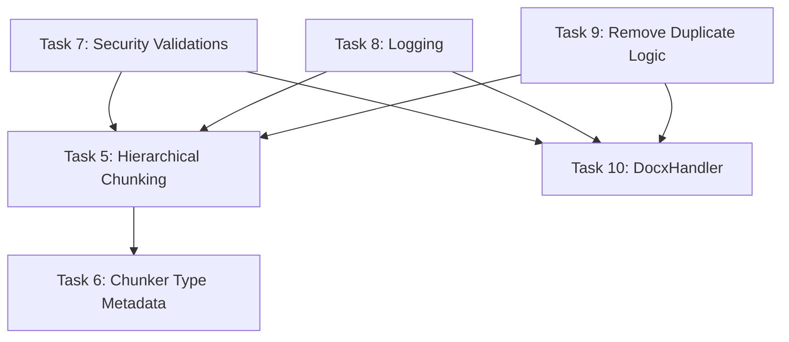

# IntelliRAG Remaining Tasks Implementation Plan

**Date:** 2025-12-10
**Project:** IntelliRAG - Production-Ready RAG System
**Methodology:** Test-Driven Development (TDD)
**Coverage Target:** >80%

---

## Overview

This document provides a comprehensive implementation plan for completing the remaining 6 tasks (Tasks #5-#10) in the IntelliRAG DocumentChunker refactoring project. The plan follows strict TDD methodology with the RED-GREEN-REFACTOR cycle and prioritizes tasks based on security criticality and architectural importance.

## Current Status

**Completed:** 4/10 tasks (40%)
- ✅ Task #1: Fix DocumentChunker tokenizer bug
- ✅ Task #2: Add model_id parameter support
- ✅ Task #3: Implement hybrid chunking strategy
- ✅ Task #4: Add token-aware length function

**Remaining:** 6/10 tasks (60%)

## Task Dependencies Analysis



## Prioritized Implementation Order

Based on dependencies and importance:

1. **Task #7:** Security Validations (HIGH Priority - Security Critical)
2. **Task #8:** Structured Logging (MEDIUM Priority - Observability)
3. **Task #9:** Remove Duplicate Chunking Logic (Code Quality)
4. **Task #5:** Hierarchical Chunking Strategy (Feature Completion)
5. **Task #10:** Create DocxHandler (Missing Component)
6. **Task #6:** Add chunker_type to Metadata (Enhancement)

---

## Task Implementation Details

### Task #7: Add Security Validations (HIGH Priority)
**Time Estimate:** 4-6 hours
**Priority:** 🔴 CRITICAL

#### Technical Approach
Implement comprehensive security validations in BaseHandler that all handlers inherit:
- File size validation (configurable, default 50MB)
- Path traversal protection using `pathlib` and secure canonicalization
- Magic bytes validation using `python-magic`
- Filename sanitization
- Extension whitelist validation

#### TDD Test Specifications

```python
# tests/unit/test_security_validations.py

def test_base_handler_rejects_oversized_files():
    """Test that handlers reject files exceeding size limit."""
    # Create file > 50MB
    # Assert validation fails with SecurityError

def test_base_handler_prevents_path_traversal():
    """Test path traversal attack prevention."""
    # Test various traversal patterns: ../, ..\, /etc/passwd
    # Assert all are rejected

def test_base_handler_validates_magic_bytes():
    """Test file content validation against declared type."""
    # Create file with wrong magic bytes
    # Assert validation fails

def test_base_handler_sanitizes_filenames():
    """Test dangerous filename sanitization."""
    # Test filenames with special chars, null bytes
    # Assert sanitized correctly
```

#### Implementation Steps

1. **RED Phase:**
   ```bash
   # Create test file
   touch tests/unit/test_security_validations.py

   # Write failing tests (see specifications above)
   vim tests/unit/test_security_validations.py

   # Run tests - MUST FAIL
   pytest tests/unit/test_security_validations.py -v
   ```

2. **GREEN Phase:**
   ```python
   # app/services/preprocessing/base.py

   import magic
   from pathlib import Path
   import os

   class SecurityError(Exception):
       """Raised when security validation fails."""
       pass

   class BaseHandler(ABC):
       MAX_FILE_SIZE = 50 * 1024 * 1024  # 50MB default
       ALLOWED_EXTENSIONS = set()  # Override in subclasses

       def secure_validate(self, file_path: Path) -> bool:
           """Perform security validations on file."""
           # Check file size
           if file_path.stat().st_size > self.MAX_FILE_SIZE:
               raise SecurityError(f"File size exceeds {self.MAX_FILE_SIZE} bytes")

           # Prevent path traversal
           canonical_path = file_path.resolve()
           if not str(canonical_path).startswith(str(Path.cwd())):
               raise SecurityError("Path traversal detected")

           # Validate magic bytes
           if hasattr(self, 'EXPECTED_MIME_TYPES'):
               mime = magic.from_file(str(file_path), mime=True)
               if mime not in self.EXPECTED_MIME_TYPES:
                   raise SecurityError(f"Invalid file type: {mime}")

           return True
   ```

3. **REFACTOR Phase:**
   - Extract validation methods for reusability
   - Add configuration options
   - Improve error messages

#### Integration Points
- Update all handlers (PDF, Image, CSV, Text) to call `secure_validate()`
- Add `EXPECTED_MIME_TYPES` to each handler class
- Update process() methods to include security checks

#### Risks & Mitigation
- **Risk:** Performance impact from magic byte checking
- **Mitigation:** Cache results, limit bytes read for validation
- **Risk:** Breaking existing functionality
- **Mitigation:** Comprehensive test coverage before refactoring

---

### Task #8: Implement Structured Logging (MEDIUM Priority)
**Time Estimate:** 3-4 hours
**Priority:** 🟡 MEDIUM

#### Technical Approach
Add structured logging using Python's logging module with JSON formatter:
- Logger per module with `__name__`
- Contextual information (file size, processing time, handler type)
- Error tracking with stack traces
- Performance metrics logging

#### TDD Test Specifications

```python
# tests/unit/test_logging_infrastructure.py

def test_handler_logs_processing_start():
    """Test that handlers log when processing starts."""
    with patch('app.services.preprocessing.base.logger') as mock_logger:
        handler.process(file_path)
        mock_logger.info.assert_called_with(
            "Processing file",
            extra={'filename': ..., 'size': ...}
        )

def test_handler_logs_errors_with_context():
    """Test error logging includes full context."""
    # Force an error
    # Assert logger.error called with exception info

def test_handler_logs_performance_metrics():
    """Test processing time is logged."""
    # Process file
    # Assert duration logged
```

#### Implementation Steps

1. **Create logging configuration:**
   ```python
   # app/core/logging.py

   import logging
   import json
   from datetime import datetime

   class StructuredFormatter(logging.Formatter):
       def format(self, record):
           log_obj = {
               'timestamp': datetime.utcnow().isoformat(),
               'level': record.levelname,
               'logger': record.name,
               'message': record.getMessage(),
               'module': record.module,
               'function': record.funcName,
           }
           if hasattr(record, 'extra'):
               log_obj.update(record.extra)
           return json.dumps(log_obj)
   ```

2. **Add logging to handlers:**
   ```python
   # app/services/preprocessing/base.py

   import logging
   import time

   logger = logging.getLogger(__name__)

   def process(self, file_path: Path, **kwargs):
       start_time = time.time()
       logger.info(
           f"Starting {self.__class__.__name__} processing",
           extra={
               'file_path': str(file_path),
               'file_size': file_path.stat().st_size,
               'handler': self.__class__.__name__
           }
       )
       try:
           # Processing logic
           result = self._process_internal(file_path, **kwargs)

           logger.info(
               f"Successfully processed file",
               extra={
                   'duration': time.time() - start_time,
                   'chunks_created': len(result.get('chunks', []))
               }
           )
           return result

       except Exception as e:
           logger.error(
               f"Processing failed: {str(e)}",
               extra={'file_path': str(file_path)},
               exc_info=True
           )
           raise
   ```

#### Integration Points
- All handler classes
- DocumentChunker class
- Main orchestrator (future)

---

### Task #9: Remove Duplicate Chunking Logic
**Time Estimate:** 2-3 hours
**Priority:** MEDIUM

#### Technical Approach
- Remove `chunk_text()` method from BaseHandler
- Update all handlers to use DocumentChunker
- Ensure consistent chunking behavior across all handlers

#### TDD Test Specifications

```python
# tests/unit/test_chunking_consolidation.py

def test_base_handler_has_no_chunk_text_method():
    """Test that BaseHandler doesn't have chunk_text method."""
    from app.services.preprocessing.base import BaseHandler
    assert not hasattr(BaseHandler, 'chunk_text')

def test_handlers_use_document_chunker():
    """Test all handlers use DocumentChunker for chunking."""
    # Mock DocumentChunker
    # Process with each handler
    # Assert DocumentChunker.chunk_text was called
```

#### Implementation Steps

1. **Update handlers to use DocumentChunker:**
   ```python
   # app/services/preprocessing/pdf.py

   from app.services.preprocessing.chunker import DocumentChunker

   def process(self, file_path: Path, **kwargs):
       # Extract text
       text = self.extract_text(file_path)

       # Use DocumentChunker instead of self.chunk_text
       chunker = DocumentChunker(
           chunk_size=kwargs.get('chunk_size', 512),
           chunk_overlap=kwargs.get('chunk_overlap', 100),
           chunker_type=kwargs.get('chunker_type', 'langchain')
       )

       chunks = chunker.chunk_text(text, metadata=metadata)

       return {
           'text': text,
           'metadata': metadata,
           'chunks': chunks
       }
   ```

2. **Remove chunk_text from BaseHandler:**
   - Delete lines 51-82 from base.py
   - Update all handler tests

---

### Task #5: Implement Hierarchical Chunking Strategy
**Time Estimate:** 4-5 hours
**Priority:** MEDIUM

#### Technical Approach
Based on research, Docling's hierarchical chunking works differently than expected. Instead of a separate HierarchicalChunker class, we'll implement structure-preserving chunking using Docling's document structure information.

#### TDD Test Specifications

```python
# tests/unit/test_hierarchical_chunking.py

def test_document_chunker_supports_hierarchical_type():
    """Test hierarchical chunker type instantiation."""
    chunker = DocumentChunker(chunker_type="hierarchical")
    assert chunker.chunker_type == "hierarchical"

def test_hierarchical_chunker_preserves_document_structure():
    """Test that hierarchical chunking preserves document hierarchy."""
    # Create document with headers, paragraphs, lists
    # Chunk with hierarchical type
    # Assert structure is preserved in metadata

def test_hierarchical_chunker_creates_semantic_chunks():
    """Test chunks are created at semantic boundaries."""
    # Test that chunks split at headers, not mid-paragraph
```

#### Implementation Steps

1. **Extend DocumentChunker for hierarchical support:**
   ```python
   # app/services/preprocessing/chunker.py

   elif chunker_type == "hierarchical":
       # Use docling_core's hierarchical chunking approach
       from docling_core.transforms.chunker.hierarchical_chunker import (
           HierarchicalChunker as DoclingHierarchicalChunker
       )

       # Note: Hierarchical chunker requires DoclingDocument
       # For now, implement structure-aware splitting
       self.splitter = RecursiveCharacterTextSplitter(
           chunk_size=chunk_size,
           chunk_overlap=chunk_overlap,
           separators=[
               "\n\n# ",    # H1 headers
               "\n\n## ",   # H2 headers
               "\n\n### ",  # H3 headers
               "\n\n",      # Paragraphs
               "\n",        # Lines
               ". ",        # Sentences
               " ",         # Words
               ""           # Characters
           ],
           is_separator_regex=False,
           keep_separator=True
       )
   ```

2. **Add structure preservation in metadata:**
   ```python
   def chunk_text(self, text: str, metadata: Optional[Dict[str, Any]] = None):
       if self.chunker_type == "hierarchical":
           # Add hierarchical context to chunks
           chunks = self._extract_hierarchical_chunks(text)
           # Add section headers to metadata
   ```

---

### Task #10: Create DocxHandler Implementation
**Time Estimate:** 3-4 hours
**Priority:** MEDIUM

#### TDD Test Specifications

```python
# tests/unit/test_preprocessing_docx.py

def test_docx_handler_exists():
    """Test DocxHandler class exists."""
    from app.services.preprocessing.docx import DocxHandler
    assert DocxHandler is not None

def test_docx_handler_inherits_base_handler():
    """Test DocxHandler inherits from BaseHandler."""
    assert issubclass(DocxHandler, BaseHandler)

def test_docx_handler_validates_docx_files():
    """Test validation of .docx files."""
    # Create temp .docx file
    # Assert validates correctly

def test_docx_handler_extracts_text():
    """Test text extraction from DOCX."""
    # Mock Docling converter
    # Assert text extracted correctly

def test_docx_handler_preserves_formatting():
    """Test that formatting is preserved."""
    # Test headers, lists, tables
```

#### Implementation

```python
# app/services/preprocessing/docx.py

from pathlib import Path
from typing import Dict, Any
from docling.document_converter import DocumentConverter

from .base import BaseHandler

class DocxHandler(BaseHandler):
    """Handler for processing DOCX files using Docling."""

    SUPPORTED_EXTENSIONS = {'.docx'}
    EXPECTED_MIME_TYPES = {
        'application/vnd.openxmlformats-officedocument.wordprocessingml.document'
    }

    def __init__(self):
        super().__init__()
        self.converter = DocumentConverter()

    def validate(self, file_path: Path) -> bool:
        """Validate DOCX file."""
        if not file_path.exists():
            return False

        if file_path.suffix.lower() not in self.SUPPORTED_EXTENSIONS:
            return False

        # Security validation
        try:
            self.secure_validate(file_path)
        except SecurityError:
            return False

        return True

    def extract_text(self, file_path: Path) -> str:
        """Extract text from DOCX using Docling."""
        try:
            result = self.converter.convert(file_path)
            return result.document.export_to_markdown()
        except Exception as e:
            logger.error(f"DOCX extraction failed: {e}")
            return ""

    def process(self, file_path: Path, **kwargs) -> Dict[str, Any]:
        """Process DOCX file."""
        # Similar to PDFHandler but for DOCX
```

---

### Task #6: Add chunker_type to Chunk Metadata
**Time Estimate:** 1-2 hours
**Priority:** LOW

#### Technical Approach
Simple addition to metadata in DocumentChunker.chunk_text()

#### TDD Test Specifications

```python
def test_chunks_include_chunker_type_in_metadata():
    """Test chunker_type is included in chunk metadata."""
    for chunker_type in ['langchain', 'hybrid', 'hierarchical']:
        chunker = DocumentChunker(chunker_type=chunker_type)
        chunks = chunker.chunk_text("Test text")
        assert all(
            chunk['metadata']['chunker_type'] == chunker_type
            for chunk in chunks
        )
```

#### Implementation

```python
# app/services/preprocessing/chunker.py

def chunk_text(self, text: str, metadata: Optional[Dict[str, Any]] = None):
    # ... existing code ...

    for i, chunk_text in enumerate(text_chunks):
        chunk_meta = metadata.copy() if metadata else {}
        chunk_meta.update({
            'chunk_index': i,
            'chunker_type': self.chunker_type,  # ADD THIS LINE
            'start_position': position,
            'end_position': position + len(chunk_text)
        })
```

---

## Implementation Schedule

| Day | Tasks | Estimated Hours |
|-----|-------|----------------|
| Day 1 | Task #7 (Security Validations) | 4-6 hours |
| Day 2 | Task #8 (Logging) + Task #9 (Remove Duplicates) | 5-7 hours |
| Day 3 | Task #5 (Hierarchical Chunking) | 4-5 hours |
| Day 4 | Task #10 (DocxHandler) + Task #6 (Metadata) | 4-6 hours |
| Day 5 | Integration testing + Documentation | 3-4 hours |

**Total Estimated Time:** 20-28 hours

---

## Success Criteria

- [ ] All 10 tasks completed
- [ ] Test coverage maintained >80% (target: 100%)
- [ ] All tests passing
- [ ] Security validations implemented and tested
- [ ] Logging infrastructure operational
- [ ] No duplicate chunking code
- [ ] All document types supported (PDF, DOCX, Image, CSV, Text)
- [ ] Documentation updated

---

## Risk Management

| Risk | Impact | Mitigation |
|------|--------|------------|
| Docling API changes | HIGH | Pin docling-core version, add integration tests |
| Security validation performance | MEDIUM | Implement caching, async validation |
| Breaking existing functionality | HIGH | Comprehensive test coverage, gradual rollout |
| Hierarchical chunking complexity | MEDIUM | Start with simple implementation, iterate |

---

## Testing Strategy

1. **Unit Tests:** Each component tested in isolation
2. **Integration Tests:** Handler + Chunker integration
3. **Security Tests:** Penetration testing for file upload
4. **Performance Tests:** Processing time benchmarks
5. **End-to-End Tests:** Complete document processing flow

---

## Documentation Updates Required

1. Update `README.md` with new security features
2. Add security configuration guide
3. Document logging format and configuration
4. Update API documentation for new handlers
5. Add chunking strategy comparison guide

---

## Dependencies & Requirements

```toml
# pyproject.toml additions
dependencies = [
    "python-magic>=0.4.27",  # For magic byte validation
    # Existing dependencies...
]
```

---

## Post-Implementation Tasks

1. Code review by senior developer
2. Security audit of file handling
3. Performance profiling
4. Update CI/CD pipeline
5. Deploy to staging environment
6. Monitor logs and metrics
7. Gather feedback and iterate

---

**Document Version:** 1.0
**Last Updated:** 2025-12-10
**Author:** Claude (AI Assistant)
**Status:** Ready for Implementation